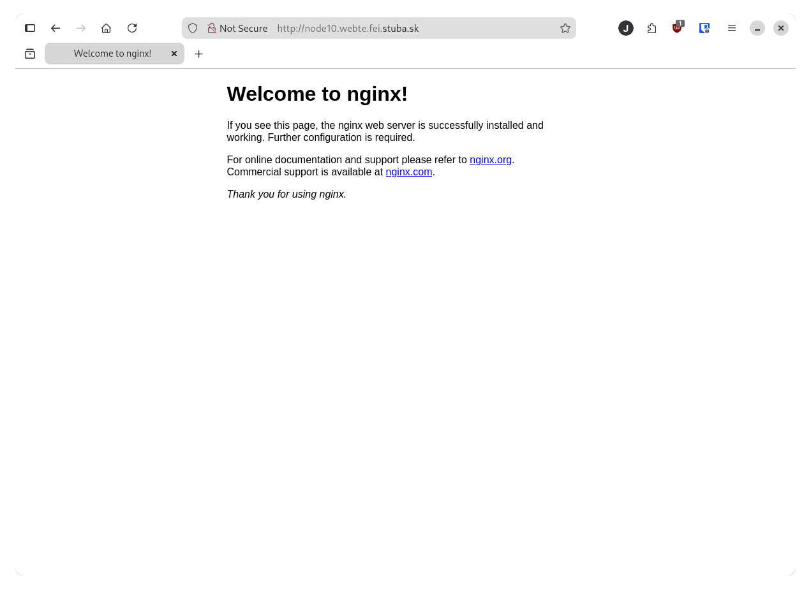
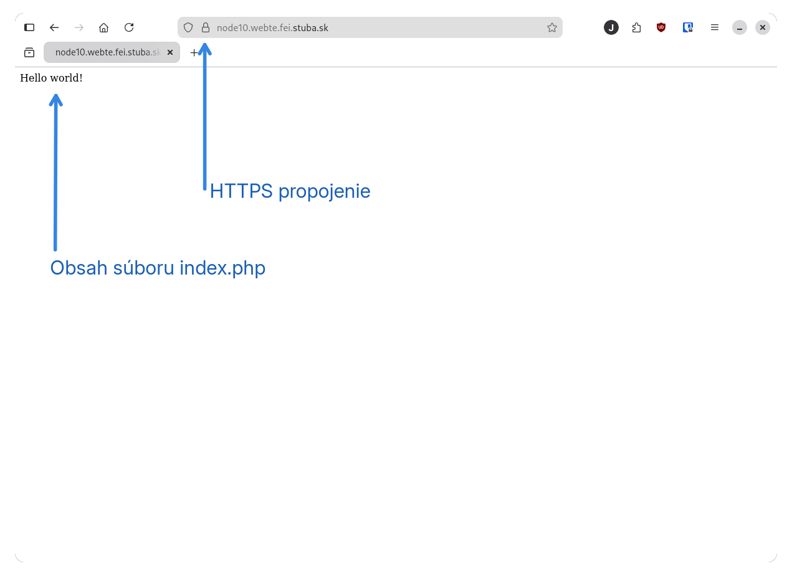
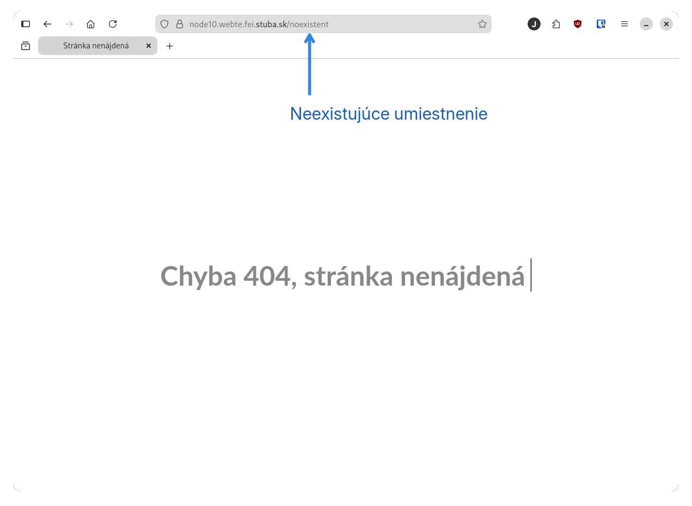
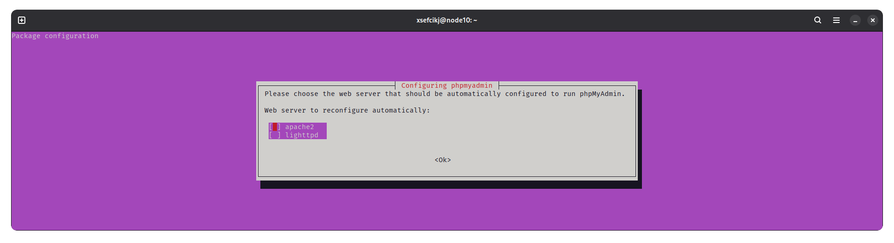
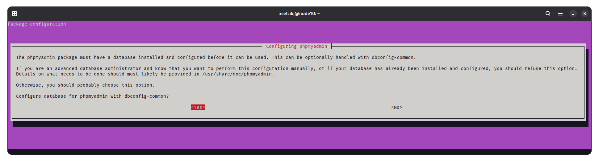
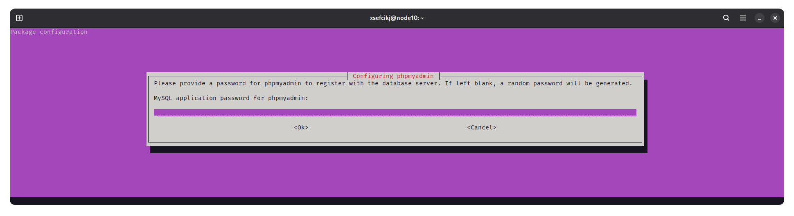
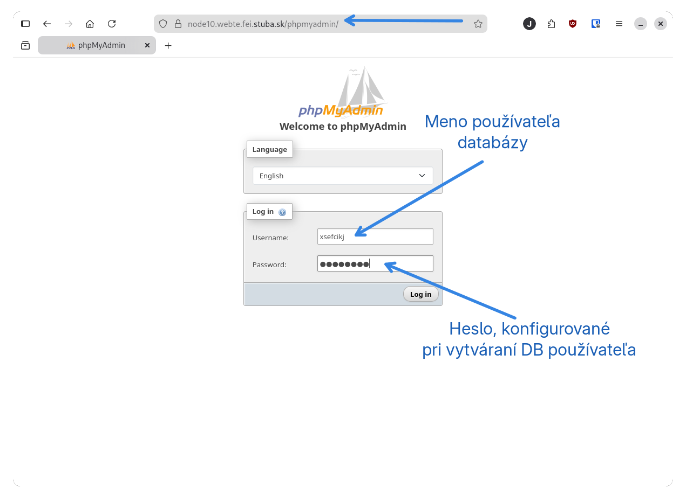
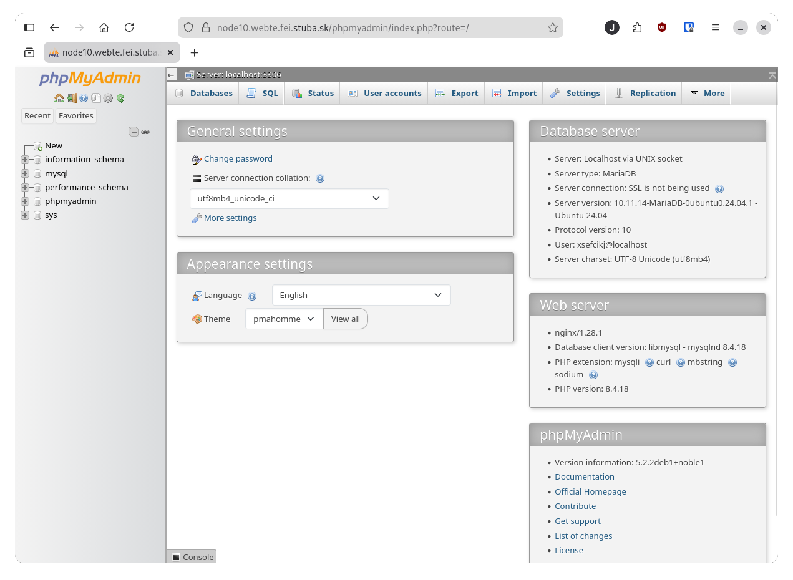

# WEBTE2 Konfigurácia serveru

## Úvod 
Konfigurácia webového servera a "LEMP Stack-u" (Linux-Nginx-MariaDB-PHP) pre predmet WEBTE2. Server je dostupný na verejnej IP adrese v tvare `147.175.105.XX`. Server má priradené aj doménové meno v tvare `nodeXX.webte.fei.stuba.sk`. Znaky **XX** v doménovom tvare adresy sú nahradené posledným číslom z IP adresy (môžu to byť 2 alebo 3 číslice).

Na server je možné prihlásiť sa prihlasovacím menom (login) a heslom, **ktorými sa prihlasujete do AIS**.

**Nemeňte heslo priradené k vášmu kontu!**

## Pripojenie k serveru pomocou SSH

Cez terminál/príkazový riadok/kozolu (CMD/Windows terminal/Bash/Terminal...) sa pripojte k svojmu pridelenému serveru. Namiesto `XX` zadajte **vaše posledné číslo z IP adresy**. Namiesto `username` zadajte váš AIS login (napr. xmrkvicka).

```sh
ssh username@147.175.105.XX
```

Pri prvom prihlásení sa zobrazí takéto, alebo podobné upozornenie (pri ďalších prihláseniach sa už táto informácia nezobrazí):

```
The authenticity of host '147.175.105.XX (147.175.105.XX)' can't be established.
ED25519 key fingerprint is SHA256:lhGu321iNdaG+aoYfcIXf4qpJCIMkKDj49HTF1oqwic.
The key is not known by any other names.
Are you sure you want to continue connecting (yes/no/[fingerprint])?
```

Napíšte do konzoly `yes`, stlačte ENTER a následne sa zobrazí výzva k zadaniu hesla. Pri zadávaní hesla nie sú viditeľné znaky, preto dbajte na správne zadanie hesla. **Nemeňte heslo priradené k vášmu kontu!**

## Update systému
Po prihlásení systém aktualizujte. Príkaz `sudo` vyžaduje zadanie hesla. Použite vaše prihlasovacie (AIS) heslo. 

```sh
sudo apt update && sudo apt -y upgrade
```

## Inštalácia balíkov LEMP stacku
Pridanie repozitárov pre novšie verzie PHP, Nginx a PhpMyAdmin.
```sh
sudo add-apt-repository ppa:ondrej/php
sudo add-apt-repository ppa:ondrej/nginx
sudo add-apt-repository ppa:phpmyadmin/ppa
```
**Každý príkaz zadávajte samostatne.** Pri pridávaní repozitárov jazyka PHP sa objaví výpis:

```sh
PPA publishes dbgsym, you may need to include 'main/debug' component
Repository: 'Types: deb
URIs: https://ppa.launchpadcontent.net/ondrej/php/ubuntu/
Suites: noble
Components: main
'
Description:
Co-installable PHP versions: PHP 5.6, PHP 7.x, PHP 8.x and most requested extensions are included. Packages are provided for *Current* Ubuntu *LTS* releases (https://wiki.ubuntu.com/Releases).  Expanded Security Maintenance releases ARE NOT supported.

Debian stable, oldstable and Debian LTS packages are provided from a separate repository: https://deb.sury.org/#debian-dpa

You can get more information about the packages at https://deb.sury.org

BUGS&FEATURES: This PPA has a issue tracker:
https://deb.sury.org/#bug-reporting

Issues reported in a private email don't scale and most likely will be ignored.  I simply don't have capacity to answer questions privately.

CAVEATS:
1. If you are using apache2, you are advised to add ppa:ondrej/apache2
2. If you are using nginx, you are advised to add ppa:ondrej/nginx

DONATION: If you like my work and you want to show appreciation, please consider donating regularly: https://donate.sury.org/

COMMERCIAL SUPPORT: Support for PHP packages for older Debian and Ubuntu release can be bought from https://www.freexian.com/lts/php/
More info: https://launchpad.net/~ondrej/+archive/ubuntu/php
Adding repository.
Press [ENTER] to continue or Ctrl-c to cancel.
```

Stlačte ENTER a prebehne pridanie repozitára.

Pri pridávaní Nginx repozitára sa objaví výpis:
```sh
PPA publishes dbgsym, you may need to include 'main/debug' component
Repository: 'Types: deb
URIs: https://ppa.launchpadcontent.net/ondrej/nginx/ubuntu/
Suites: noble
Components: main
'
Description:
This branch follows latest NGINX Stable packages compiled against latest OpenSSL for HTTP/2 and TLS 1.3 support.

BUGS&FEATURES: This PPA now has a issue tracker: https://deb.sury.org/#bug-reporting

PLEASE READ: If you like my work and want to give me a little motivation, please consider donating: https://donate.sury.org
More info: https://launchpad.net/~ondrej/+archive/ubuntu/nginx
Adding repository.
Press [ENTER] to continue or Ctrl-c to cancel.
```

Pri pridávaní PhpMyAdmin repozitára sa objaví výpis:

```sh
Repository: 'Types: deb
URIs: https://ppa.launchpadcontent.net/phpmyadmin/ppa/ubuntu/
Suites: noble
Components: main
'
Description:
Packages for Ubuntu, maintained on salsa.debian.org/phpmyadmin-team

You can use this packages on production at your own risk, please wait until they are released through the official Ubuntu-channels for additional safety.

That said packages are normally the same as in Ubuntu or Debian. 

-> Find more information about this PPA on our wiki:

https://github.com/phpmyadmin/phpmyadmin/wiki/DebianUbuntu


More info: https://launchpad.net/~phpmyadmin/+archive/ubuntu/ppa
Adding repository.
Press [ENTER] to continue or Ctrl-c to cancel.
```

Znovu stlačte ENTER a repozitár sa pridá do systému. Napokon zavolajte príkaz pre aktualizáciu systémových balíkov:

```sh
sudo apt update
```

### MariaDB Databázový server
Nainštalujte MariaDB server zadaním príkazu
```sh
sudo apt install -y mariadb-server
```

Inštalácia môže trvať dlhšie. Po úspešnej inštalácii spustite skript na inicializáciu a zabezpečenie `mariadb-server` databázového serveru:
```sh
sudo mariadb-secure-installation
```
**POZOR! Počas inštalácie pozorne sledujte terminál a zadajte korektné odpovede!**

**Odpovede na otázky počas konfigurácie:**
```sh
NOTE: RUNNING ALL PARTS OF THIS SCRIPT IS RECOMMENDED FOR ALL MariaDB
      SERVERS IN PRODUCTION USE!  PLEASE READ EACH STEP CAREFULLY!

In order to log into MariaDB to secure it, we'll need the current
password for the root user. If you've just installed MariaDB, and
haven't set the root password yet, you should just press enter here.

Enter current password for root (enter for none):
```
Stlačte iba **ENTER**.

---

```sh
Setting the root password or using the unix_socket ensures that nobody
can log into the MariaDB root user without the proper authorisation.

You already have your root account protected, so you can safely answer 'n'.

Switch to unix_socket authentication [Y/n] y
```
Zadajte **y**.

---

```sh
Reloading privilege tables..
 ... Success!


You already have your root account protected, so you can safely answer 'n'.

Change the root password? [Y/n] n
```
Zadajte **n**.

---

```sh
By default, a MariaDB installation has an anonymous user, allowing anyone
to log into MariaDB without having to have a user account created for
them.  This is intended only for testing, and to make the installation
go a bit smoother.  You should remove them before moving into a
production environment.

Remove anonymous users? [Y/n] y

```
Zadajte **y**

---

```sh
Normally, root should only be allowed to connect from 'localhost'.  This
ensures that someone cannot guess at the root password from the network.

Disallow root login remotely? [Y/n] y
```
Zadajte **y**

---

```sh
By default, MariaDB comes with a database named 'test' that anyone can
access.  This is also intended only for testing, and should be removed
before moving into a production environment.

Remove test database and access to it? [Y/n] y
```
Zadajte **y**

---

```sh
Reloading the privilege tables will ensure that all changes made so far
will take effect immediately.

Reload privilege tables now? [Y/n] y
```
Zadajte **y**

---

Po skončení sa pripojte ku MariaDB konzole:
```sh
sudo mariadb
```
Prompt sa zmení na `MariaDB [(none)]>`: 
```sh
Welcome to the MariaDB monitor.  Commands end with ; or \g.
Your MariaDB connection id is 39
Server version: 10.11.14-MariaDB-0ubuntu0.24.04.1 Ubuntu 24.04

Copyright (c) 2000, 2018, Oracle, MariaDB Corporation Ab and others.

Type 'help;' or '\h' for help. Type '\c' to clear the current input statement.

MariaDB [(none)]> 
```
Vytvorte si nového používateľa pre prístup a správu databáz. Vytvorte si používateľa s rovnakým menom, s akým sa prihlasujete na server. Heslo si zvoľte iné ako slovo `password` a iné ako do AIS. **Heslo si dobre zapamätajte a niekde zapíšte!** Príkazy nekopírujte ale prepíšte si ich ručne, dbajte na správne znaky - najmä apostrofy pri identifikátoroch mena, hesla a hostu a nezabudnite na bodkočiarku na konci príkazov.
```sh
MariaDB [(none)]> CREATE USER 'username'@'localhost' IDENTIFIED BY 'password';
```
Pridanie privilégií pre prácu s databázami:
```sh
MariaDB [(none)]> GRANT ALL PRIVILEGES ON *.* TO 'username'@'localhost';
MariaDB [(none)]> FLUSH PRIVILEGES;
```
Opustenie konzoly MariaDB pomocou `Ctrl + d` alebo `exit`.

Pre kontrolu sa prihláste do MariaDB konzoly pod novým používateľom a jeho heslom (tým, ktorého ste práve vytvorili):
```sh
mariadb -u username -p
```

### Nginx a PHP interpreter

Nainštalujte webový server Nginx spolu s interpreterom jazyka PHP a textovým editorom Nano:
```sh
sudo apt install -y nginx php-fpm nano
```

Po navštívení vašej IP adresy vo webovom prehliadači alebo `nodeXX.webte.fei.stuba.sk` (pri nahradení **XX** za vaše posledné číslo z IP adresy) by webový prehliadač mal zobrazovať:


Potom pridajte používateľa do skupiny www-data:
```sh
sudo usermod -aG www-data $USER
```

Zmena skupiny sa štandardne prejaví až pri opätovnom prihlásení. Aby sme ale nemuseli čakať alebo reštartovať server, môžeme sa do novej skupiny prihlásiť hneď príkazom:
```sh
newgrp www-data
```
Pre overenie prístupu do skupiny môžeme zavolať príkaz `groups` ktorý by mla zobraziť skupiny, do ktorých máme prístup, pričom namiesto `username` by ste mali mať váš AIS login (napr. `xmrkvicka`):
```sh
groups
www-data adm sudo username
```
V prípade, že sa zmena neprejavila, skontrolujte príkaz pridania do skupiny alebo sa odhláste a nanovo prihláste.

Pre overenie inštalácie PHP zadajte príkaz `php -v`, ktorý by mal vrátiť výstup:
```sh
PHP 8.4.18 (cli) (built: Feb 13 2026 16:00:19) (NTS)
Copyright (c) The PHP Group
Built by Debian
Zend Engine v4.4.18, Copyright (c) Zend Technologies
    with Zend OPcache v8.4.18, Copyright (c), by Zend Technologies
```

### Vytvorenie adresára pre webové stránky
Adresáre a skripty z tohoto umiestnenia sa budú zobrazovať po navštívení pridelenej domény. Pre zapisovanie do tohoto adresára a korektné zobrazovanie webovým serverom, musí adresár patriť pod skupinu a používateľa `www-data`.

```sh
cd /var
sudo chown -R www-data:www-data www/
sudo chmod g+w -R www/
```

Po zmene oprávnení je možné zapisovať do adresára ```/var/www``` bez sudo privilégií. Vytvoríme následne adresár pre našu doménu. Nezabudnite nahradiť **XX** posledným číselným segmentom z vašej IP adresy:
```sh
cd /var/www
mkdir nodeXX.webte.fei.stuba.sk
cd nodeXX.webte.fei.stuba.sk
```

Vytvoríme jednoduchý PHP skript, ktorý nazveme `index.php` do ktorého vložíme výpis textu Hello World. Súbor vytvoríme pomocou editora `nano`:
```sh
nano index.php
```
Otvorí sa textový editor a vložíme do neho text skriptu:
```php
<?php
	echo "Hello world!"
?>
```
Uložíme pomocou `Ctrl+o` a ukončíme editor pomocou `Ctrl+x`.

### Vytvorenie Virtual host konfigurácie pre URL
Aby webový server vedel, v ktorom adresári sa nachádzajú PHP skripty stránok a ktorý proces má byť použitý na interpretáciu týchto súborov, musíme vytvoriť tzv. Virtual Host Configuration pre Nginx. Ide o konfiguračný súbor, ktorý hovorí, kde sa nachádzajú súbory a adresáre stránok a rôzne ďalšie parametre pre interpreter. Zmeny budeme vykonávať z úrovne domovského adresára, do ktorého sa presunieme príkazom `cd`. Vytvoríme nový súbor - reťazec **XX** nahraďte prideleným číslom podľa IP adresy:

> **Pozor** na správne názvy súborov. Zo skúseností z minulých rokov vieme, že v pri týchto krokoch vzniká najviac chýb. Konfiguračný súbor **nesmie obsahovať znaky XX**, musíte si ich prepísať. Preto **dôrazne neodporúčame príkazy nezmyselne kopírovať ale prepisovať** a správne zadávať číslo z IP adresy.

```sh
cd
sudo nano /etc/nginx/sites-available/nodeXX.webte.fei.stuba.sk
```
 
Do nového súboru napíšte nasledujúcu konfiguráciu virtual hosts a zameňe všetky reťazce **XX** (sú tam 3x) za posledný číselný segment priradenej IP adresy:

```sh
server {
       listen 80;
       listen [::]:80;

       server_name nodeXX.webte.fei.stuba.sk;

       rewrite ^ https://$server_name$request_uri? permanent;
}

server {
        listen 443 ssl;
        listen [::]:443 ssl;

        server_name nodeXX.webte.fei.stuba.sk;

        access_log /var/log/nginx/access.log;
        error_log  /var/log/nginx/error.log info;

        root /var/www/nodeXX.webte.fei.stuba.sk;
        index index.php index.html;

        ssl_certificate /etc/ssl/certs/webte_fei_stuba_sk.pem;
        ssl_certificate_key /etc/ssl/private/webte.fei.stuba.sk-ec.key;

        location ~ \.php$ {
                include snippets/fastcgi-php.conf;
                fastcgi_pass unix:/var/run/php/php8.4-fpm.sock;
        }
}
```

Vytvoríme symbolický odkaz súboru pre aktivovanie konfigurácie.
```sh
cd ~ && sudo ln -s /etc/nginx/sites-available/nodeXX.webte.fei.stuba.sk /etc/nginx/sites-enabled/
```

Reštartujte Nginx príkazom:
```sh
sudo service nginx restart
```

Po navštívení pridelenej domény vo webovom prehliadači by sa mala stránka načítať prostredníctvom HTTPS protokolu. Na stránke by ste mali vidieť text Hello World.

V prípade, že príkaz reštartovania serveru vráti chybu, skontrolujte vytvorený konfiguračný súbor, či obsahuje správne cesty, bodkočiarky, kľúčové slová a zátvorky.

### Vlastná stránka pre chybu 404
Vytvoríme si v koreňovom adresári stránok súbor:
```sh
nano /var/www/nodeXX.webte.fei.stuba.sk/404.html
```
Do súboru vložíme zmysluplný text, ktorý sa zobrazí vždy pri požiadavke na neexistujúci zdroj namiesto štandardnej chybovej stránky serveru. Pre príklad môžete použiť súbor `404.html`, ktorý sa nachádza v tomto repozitári v adresári `src`.

Do Virtual Host Configuration
```sh
sudo nano /etc/nginx/sites-available/nodeXX.webte.fei.stuba.sk
```
za riadok `index index.php index.html;` doplníme:
```sh
error_page 404 /404.html;
location = /404.html {
    root /var/www/nodeXX.webte.fei.stuba.sk/;
    internal;
}
```
> Nezabudnite prepísať znaky **XX** posledným segmentom vašej IP adresy!

Po reštarte serveru príkazom
```sh
sudo service nginx restart
```
by sa po navštívení neexistujúcej URL (napr. `/noexistent`) na vašom serveri mala zobraziť už vlastná stránka chyby 404:


### PHPMyAdmin - Prostredie pre správu databáz
Inštalácia WebGUI utility pre správu databázy cez prehliadač.

```sh
sudo apt install -y phpmyadmin
```
V priebehu inštalácie sa môže zobraziť niekoľko informácií, ktoré treba sledovať. Informácia sa zobrazí buď v sivom okne na fialovom pozadí alebo priamo v príkazovom riadku.

Ak sa zobrazí táto informácia:

Nič nemeňte iba stlačte ENTER.

Ak sa zobrazí informácia:

Stlačte iba ENTER (nad Yes), alebo:

Napíšte `yes` a stlačte ENTER.

Následne sa objaví informácia o hesle:

alebo:

Nič nevypĺňajte, iba stlačte ENTER.

Vytvorte konfiguračný súbor PHPMyAdmin pre server Nginx:
```sh
sudo nano /etc/nginx/snippets/phpmyadmin.conf
```
Do súboru vložte nasledovný kód:
```sh
location /phpmyadmin {
    root /usr/share/;
    index index.php index.html index.htm;
    location ~ ^/phpmyadmin/(.+\.php)$ {
        try_files $uri =404;
        root /usr/share/;
        fastcgi_pass unix:/run/php/php8.4-fpm.sock;
        fastcgi_index index.php;
        fastcgi_param SCRIPT_FILENAME $document_root$fastcgi_script_name;
        include /etc/nginx/fastcgi_params;
    }

    location ~* ^/phpmyadmin/(.+\.(jpg|jpeg|gif|css|png|js|ico|html|xml|txt))$ {
        root /usr/share/;
    }
}
```
Upravte Virtual Host configuration serveru:
```sh
sudo nano /etc/nginx/sites-available/nodeXX.webte.fei.stuba.sk
```
Pred poslednú zloženú zátvorku pridajte riadok:
```sh
include snippets/phpmyadmin.conf;
```

Výsledná podoba Virtual Host Configuration bude nasledovná (všetky **XX** musia byť nahradené posledným číselným segmentom vašej IP adresy!):
```sh
server {
       listen 80;
       listen [::]:80;

       server_name nodeXX.webte.fei.stuba.sk;

       rewrite ^ https://$server_name$request_uri? permanent;
}

server {
        listen 443 ssl;
        listen [::]:443 ssl;

        server_name nodeXX.webte.fei.stuba.sk;

        access_log /var/log/nginx/access.log;
        error_log  /var/log/nginx/error.log info;

        root /var/www/nodeXX.webte.fei.stuba.sk;
        index index.php index.html;

        error_page 404 /404.html;
        location = /404.html {
            root /var/www/nodeXX.webte.fei.stuba.sk/;
            internal;
        }

        ssl_certificate /etc/ssl/certs/webte_fei_stuba_sk.pem;
        ssl_certificate_key /etc/ssl/private/webte.fei.stuba.sk-ec.key;

        location ~ \.php$ {
                include snippets/fastcgi-php.conf;
                fastcgi_pass unix:/var/run/php/php8.4-fpm.sock;
        }
        
        include snippets/phpmyadmin.conf;
}
```

Reštartujte server príkazom:
```sh
sudo service nginx restart
```
Po navštívení stránky: `https://nodeXX.webte.fei.stuba.sk/phpmyadmin` sa zobrazí prihlasovacia obrazovka pre PhpMyAdmin. Prihlásite sa pomocou údajov, ktoré ste zadali pri vytváraní používateľa v MariaDB serveri. Ak ste postupovali podľa návodu, mal by to byť váš AIS login a heslo, ktoré ste si niekde zapísali.


Po prihlásení budete mať k dispozícii rozhranie PhpMyAdmin:
