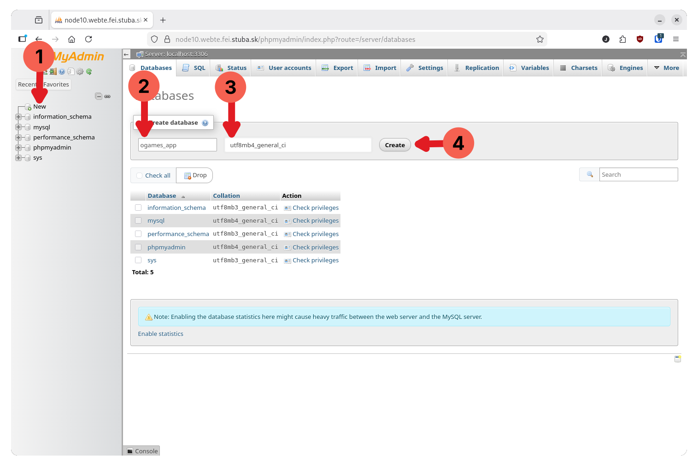
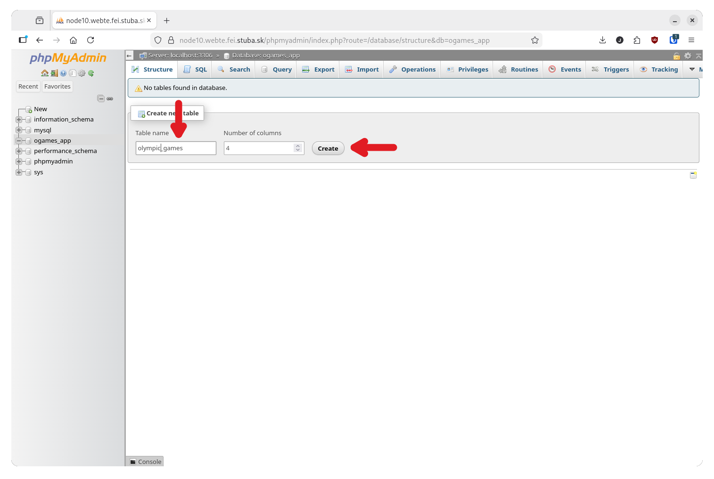
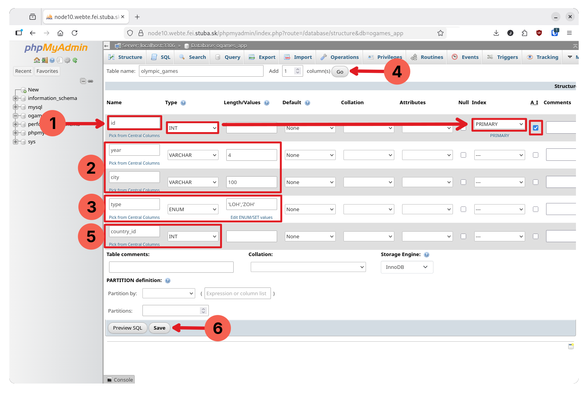
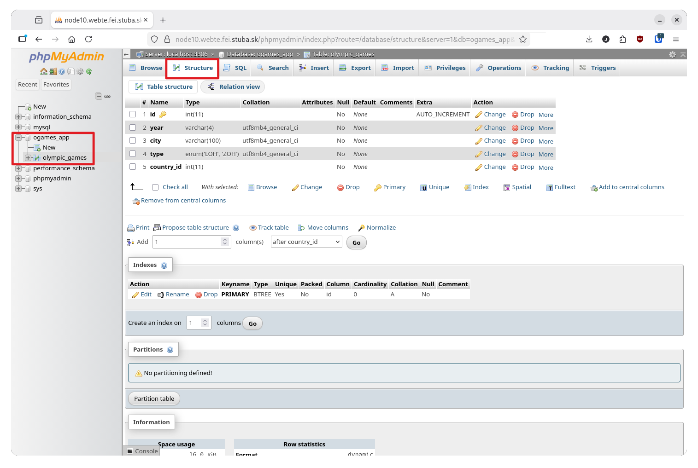
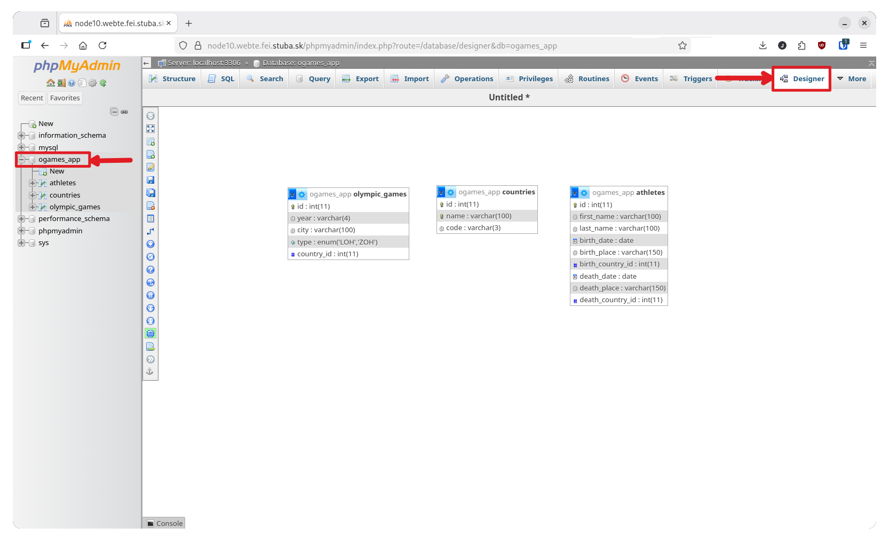
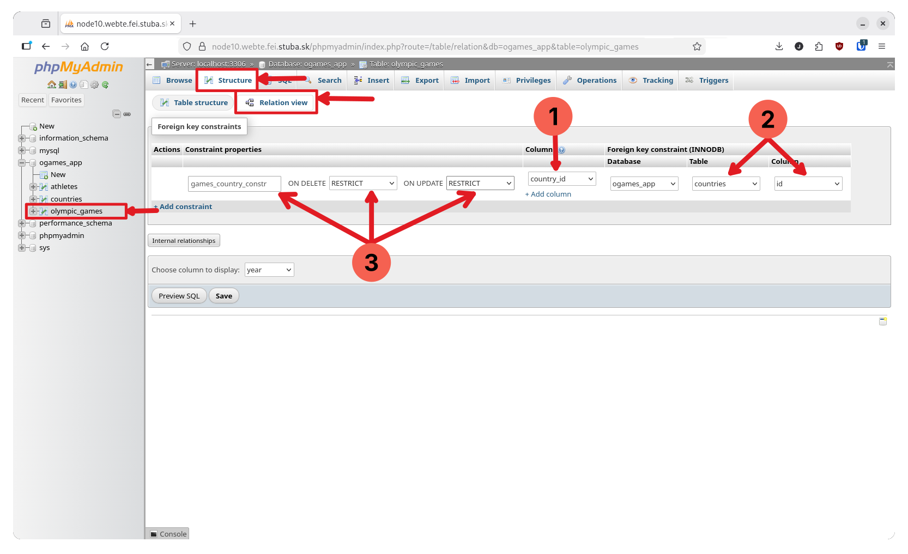
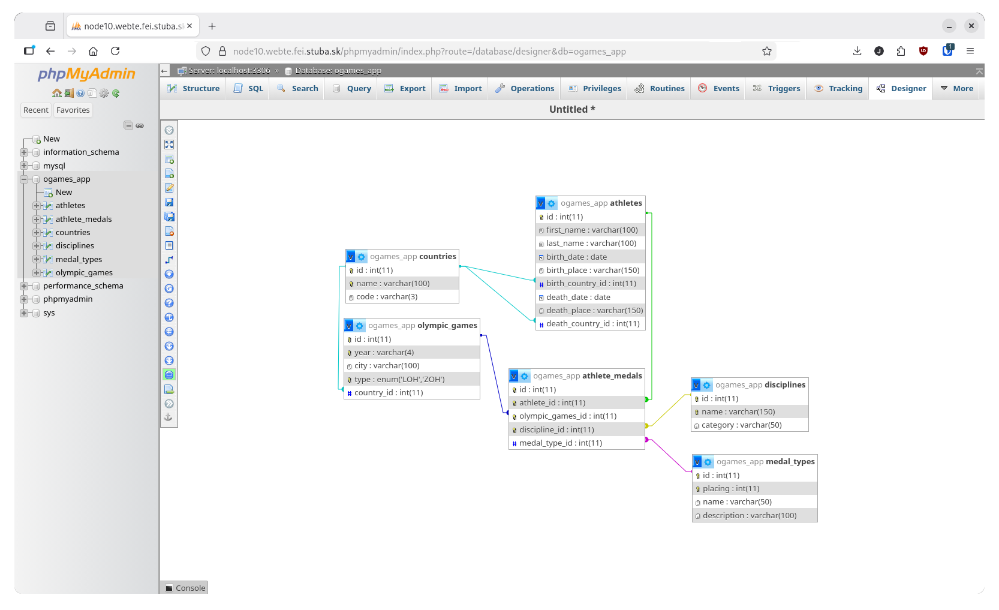
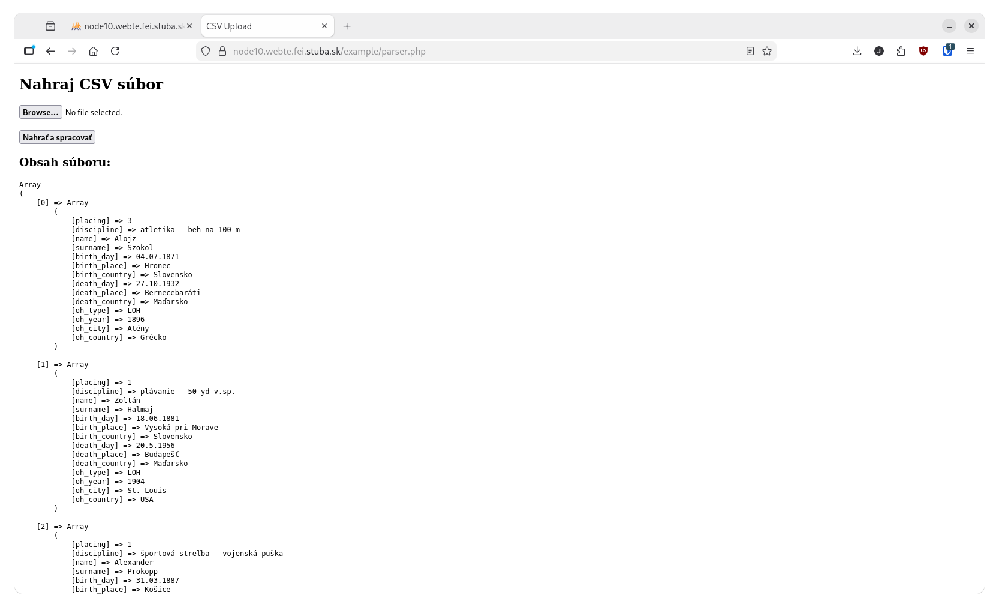

# Prvé zadanie

V prvom zadaní bude potrebné vhodne si navrhnúť databázu na základe poskytnutého súboru. Súbor s dátami je vo formáte `xlsx` a obsahuje dva hárky. V hárkoch sa nachádzajú informácie o slovenských účastníkoch olympijských hier, spolu s ďalšími informáciami, napr. dátum ich narodenia, rok, kedy získali olympijskú medailu spolu s miestom konania hier a druhom olympijských hier.

Súbor s dátami je potrebné dobre si preštudovať a vhodne si navrhnúť databázu, ktorá bude obsahovať minimálne tri tabuľky. V ideálnom prípade by sa v tabuľkách údaje v rámci záznamov nemali opakovať.

## Návrh databázy

Predtým ako sa pustíme do nahrávania dát na server a do databázy, musíme si vytvoriť databázu a tabuľky, ktoré navzájom prepojíme. Na tento účel sme si nainštalovali rozhranie _PhpMyAdmin_. Po prihlásení do webového rozhrania si vytvoríme novú databázu:

1. V ľavom paneli klikneme na tlačidlo novej databázy,
2. Zvolíme si názov databázy - je dobré vyhnúť sa diakritike, medzerám a iným špeciálnym znakom. Ak chceme oddeliť slová, najvhodnejší je na to podtržník (_underscore_)
3. **Najdôležitejšie je zvoliť správne kódovanie dát - znakovú sadu pre dáta v tabuľkách.** Dbajte na to, aby ste použili UTF-8.
4. Napokon potvrdíme vytvorenie databázy.

> Webové rozhranie umožňuje aj vytváranie databáz a tabuliek pomocou SQL kódu. Stačí v rozhraní databázy alebo tabuľky kliknúť na záložku SQL a môžeme písať SQL príkazy a dopyty.



Nová databáza zatiaľ nemá žiadne tabuľky. Vytvoríme si teda novú tabuľku. Ak neviete, koľko stĺpcov má presne mať, nevadí. Tie vieme pridať alebo odstrániť aj dodatočne. Nová tabuľka by mala mať hlavne nejaký zmysluplný názov. Opäť si zvoľte taký, ktorý neobsahuje diakritiku alebo špeciálne znaky.



Po vytvorení tabuľky vieme pridávať stĺpce. Každý stĺpec má viacero atribútov, ktoré mu vieme nastaviť, napr. názov, dátový typ, default hodnota a pod. Do prvej tabuľky budeme zaznamenávať miesta, kde sa konali olympijské hry. Každé hry majú typ, rok konania, poradie v akom sa uskutočnili, mesto a krajinu. Okrem týchto stĺpcov by každá tabuľka mala obsahovať aj jedinečný identifikátor.

1. Prvý stĺpec bude indentifikátor záznamu, bude mať názov `id`, bude typu `INT` (celé číslo), určíme ho ako primárny kľúč (Index) a zaškrtneme atribút **A**uto **I**ncrement
2. Stĺpce `year` a `city` budú typu `VARCHAR` - reťazec premenlivej dĺžky. Stĺpec pre rok bude mať max. dĺžku 4 a stĺpec pre mesto max. dĺžku 100 znakov.
3. Stĺpec `type` môže byť typu `ENUM`, keďže bude obsahovať iba dve možné hodnoty: LOH a ZOH. Tieto hodnoty môžeme zadať priamo do políčka - musia byť medzi apostrofmi `'` a oddelené čiarkou: `'LOH','ZOH'`
4. Keďže sme na začiatku vytvorili tabuľku len so 4 stĺpcami, pomocou tlačidla `Go` pod hornou lištou pridáme jeden stĺpec.
5. Pridaný stĺpec bude mať názov `country_id`, bude typu `INT` - použijeme ho ako cudzí kľúč pre ďalšiu tabuľku.
6. Tabuľku uložíme tlačidlom `Save`.



Po vytvorení tabuľky sa nám zobrazí prehľad štruktúry tabuľky. Toto zobrazenie je prístupné po kliknutí na ktorúkoľvek tabuľku databázy z karty _Structure_. V tomto zobrazení môžeme tabuľku rôzne upravovať: pridávať stĺpce, meniť názvy stĺpcov, pridávať indexy, definovať vzťahy alebo upravovať iné atribúty tabuľky. Môžeme napríklad označiť stĺpce `year` a `type` a nastaviť im _Unique_ obmedzenie - nemôže sa v tabuľke vyskytovať rovnaká kombinácia typu hier a roku.



Podobným spôsobom ako sme vytvorili tabuľku pre miesta konania hier si vytvoríme ďalšie tabuľky: krajiny, športovcov, ocenenia a podobne. Je potrebné si dobre prezrieť súbor s dátami a uvedomiť si, ktoré údaje sú jedinečné a ktoré sa opakujú a môžeme sa na ne iba odkazovať.

## Previazanie tabuliek

Máme vytvorené tabuľky hier, športovcov a krajín. Tabuľky si v _PhpMyAdmin_ vieme prehľadne zobraziť po kliknutí na databázu a následne v hornom paneli vybrať záložku _Designer_.



Teraz potrebujeme tabuľky navzájom previazať - vytvoriť cudzie kľúče a odkazovať na ne. V tomto prípade ide o jednoduché vzťahy:

- `olympic_games` a `countries` -> 1:N - jedna krajina môže hostiť viacero olympijských hier
- `athletes` a `countries` -> N:1 - každý športovec má jednu krajinu narodenia a každý športovec môže mať jednu krajinu úmrtia (`NULL` ak žije).

Vytvoríme najprv vzťah medzi olympijskými hrami a krajinou konania. Zvolíme si tabuľku `olympic_games`. V nej klikneme na _Relation view_, kde môžeme nastavovať cudzie kľúče a ich vlastnosti:

1. Stĺpec, **ktorý bude cudzím kľúčom** bude `country_id`.
2. Tabuľka a stĺpec, **na ktorý sa kľúč odkazuje** bude `country` a stĺpec `id`.
3. Zadefinujeme aj názov obmedzenia pre vymazanie a aktualizáciu záznamu, názov si môžeme zvoliť, ak ho nevyplníme, nastaví sa automaticky. Pre _ON DELETE_ a _ON UPDATE_ máme možnosti `RESTRICT`, `CASCADE`, `SET NULL` alebo `NO ACTION`.



Možnosti `RESTRICT`, `CASCADE`, `SET NULL` alebo `NO ACTION` v nastavení cudzieho kľúča majú nasledovný význam:

- `RESTRICT` - Zakáže operáciu: Nedovolí zmazať riadok/hodnotu primárneho kľúča v rodičovskej tabuľke, ak naň existujú odkazy (cudzie kľúče) v inej tabuľke.
- `CASCADE` - Ak sa v rodičovskej tabuľke vymaže riadok/zmení hodnota primárneho kľúča, databáza automaticky zmaže všetky súvisiace riadky v podriadenej tabuľke/aktualizuje cudzí kľúč v závislých tabuľkách.
- `SET NULL` - Ak sa v rodičovskej tabuľke vymaže riadok/zmení hodnota primárneho kľúča, databáza automaticky nastaví cudzí kľúč v podriadenej tabuľke na `NULL`. Aby `SET NULL` fungovalo, stĺpec, ktorý je cudzím kľúčom musí povoľovať `NULL`, inak DB vráti error.
- `NO ACTION` - Prakticky to isté ako RESTRICT (v MySQL)

Podobne, ako sme upravili tabuľku hier môžeme upraviť aj tabuľku so športovcami, kde máme dva odkazy na krajinu - krajinu narodenia a úmrtia, ktorá môže byť aj `NULL`.

Takýmto spôsobom je potrebné vytvoriť si tabuľky pre ukladanie zvyšných údajov zo súboru. Je na vás, ktorý spôsob si zvolíte a ako budete ukladať informácie o medailách športovcov v jednotlivých disciplínach. Jedným z príkladov výslednej štruktúry môže byť napr. takáto databáza:



V tomto prípade tabuľka `athlete_medals` funguje ako asociatívna tabuľka ktorá:

- Prepája športovcov s ich výkonmi
- Vytvára _many-to-many_ vzťah medzi `athletes` a `olympic_games` (športovec môže súťažiť na viacerých OH, na OH súťaží viacero športovcov)

## Spracovanie záznamov

Súbor s dátami je potrebné spracovať na strane serveru tak, že ho načítame z webového prehliadača. Aby sme nemuseli parsovať `xlsx` súbor, môžeme si dáta rozdeliť napríklad na dva `csv` súbory, ktoré postupne načítame, alebo hárky zlúčiť do jedného `csv` súboru. S formátom `csv` sa bude pracovať ľahšie.

Vytvoríme si jednoduchý PHP skript. Tento skript bude obsahovať iba formulár s políčkom pre nahranie súboru a tlačidlom, ktorým súbor odošleme a spracujeme. Samotný formulár je veľmi jednoduchý:

```html
<!-- Samozrejme nezabudnime na vsetky nalezitosti HTML dokumentu, tzn. DOCTYPE, hlavicka nadpis a pod... -->
<form method="POST" enctype="multipart/form-data">
  <input type="file" name="csv_file" accept=".csv" required />
  <br /><br />
  <button type="submit">Nahrať a spracovať</button>
</form>
```

Keďže v PHP súboroch sa kód HTML a PHP mieša, môžeme si dovoliť niečo takéto:

```php
<?php

$data = []; // Definicia premennej pre ukladanie obsahu csv

// Ak bol odoslany formular, a vo formulari sa nachadza subor s klucom csv_file, spracujeme ho.
if ($_SERVER['REQUEST_METHOD'] === 'POST' && isset($_FILES['csv_file'])) {

    $file = $_FILES['csv_file'];  // Ziskame subor zo superglobal pola
    $ext = pathinfo($file['name'], PATHINFO_EXTENSION);  // Zistime pripomu suboru...

    if (strtolower($ext) !== 'csv') {  // ...a skontrolujeme, ci ide o csv subor.
        die("Povolené sú iba CSV súbory.");  // Ak nie, skript sa ukonci.
    }

    if ($file['error'] === 0) {  // Ak bol subor nacitany bez chyby...
        $data = parseCsvToAssocArray($file['tmp_name'], ";");  // ...spracujeme ho pomocou funkcie.
    }
}
?>

<!DOCTYPE html>
<html lang="sk">
<head>
    <meta charset="UTF-8">
    <title>CSV Upload</title>
</head>
<body>

<form method="POST" enctype="multipart/form-data">
    <input type="file" name="csv_file" accept=".csv" required>
    <br><br>
    <button type="submit">Nahrať a spracovať</button>
</form>

<?php if (!empty($data)): ?>
    <h3>Obsah súboru:</h3>
    <pre><?php print_r($data); ?></pre>
<?php endif; ?>

</body>
</html>
```

Formuláre sme spracovávali už v zimnom semestri. V tomto prípade po stlačení tlačidla na odoslanie formuláru sa dáta formuláru - nahratý súbor - spracujú pomocou toho istého skriptu a na stránku sa vypíše obsah premennej dáta. Dáta sa uložia do asociatívneho poľa, v ktorom sú hodnoty prístupné prostredníctvom kľúčov (niečo podobné ako objekty v JS alebo `dict` v Pythone - ale nie je to to isté). Funkcia `parseCSV` by mohla vyzerať napr. takto:

```php
<?php
function parseCsvToAssocArray(string $filePath, string $delimiter = ";"): array
{
    $result = [];
    // TODO: kontrola, ci subor na danej ceste existuje.
    $handle = fopen($filePath, 'r');
    // TODO: kontrola, ci sa subor podarilo otvorit.
    $headers = fgetcsv($handle, 0, $delimiter); // Nacitanie hlavicky - prveho riadku suboru. Nazvy v hlavicke sa pouziju ako kluce asoc. pola.
    // TODO: kontrola, ak hlavicka neexistuje.

    // Parsovanie riadkov
    while (($row = fgetcsv($handle, 0, $delimiter)) !== false) {
        if (count($row) === count($headers)) {
            $data[] = array_combine($headers, $row);
        }
    }

    // Korektne ukoncenie prace so suborom a vratenie spracovanych dat.
    fclose($handle);
    return $data;
}
?>
```

> Pozor na oddeľovač - _delimiter_ - v CSV súbore a pri jeho ukladaní je možné ho nastaviť. V tomto prípade je nastavený na bodkočiarku ale v niektorých prípadoch to môžu byť aj iné znaky.

Po načítaní CSV súboru môže výstup vyzerať nejako takto:



## Pripojenie k databáze

V PHP jazyku máme viacero spôsobov pripojenia sa k databáze. V tomto prípade použijeme PDO a pripojenie si zadefinujeme v súbore `config.php`. Budeme používať ako centrálny konfiguračný bod aplikácie, ktorý môžeme importovať (`include`/`require`) do ostatných PHP súborov. Význam skriptu je vysvetlený v komentároch.

```php
<?php
// config.php

// Prikazy ini_set() a error_reporting() zabezpecuju:
// vsetky chyby a upozornenia PHP budú zobrazené priamo na stranke,
// zobrazia sa aj chyby pri starte skriptu,
// E_ALL znamena, ze sa zobrazia vsetky typy chyb.

// POZOR: Pouzivajte VYHRADNE vo vyvojovom prostredi prostredí (localhost, test server). Pri nasadeni musia byt tieto nastavenia vypnute - zakomentovane.
ini_set('display_errors', 1);
ini_set('display_startup_errors', 1);
error_reporting(E_ALL);

// Databazove konkfiguracne premenne:
$hostname = "localhost";  // adresa servera, kedze DB je na rovnakom zeleze ako Nginx, je tu localhost
$database = "DB_NAME";  // nazov databazy - v nasom pripade to bolo ogames_app
$username = "DB_USERNAME";  // nazov pouzivatela - ktoreho ste vytvarali cez MariaDB konzolu. Ak ste isli podla navodu, mal by to byt vas login.
$password = "DB_PASSWORD";  // heslo, ktore ste zadavali v MariaDB konzole - mali ste si ho zapisat alebo zapamatat.

// Funkcia sluzi ako abstrakcia pripojenia k DB – po include ju mozeme zavolat.
function connectDatabase($hostname, $database, $username, $password) {
    try {
        // Vytvorenie objektu PDO a nadviazanie spojenia s databazou. Aj ked je tu mysql, MariaDB je plne kompatibilna.
        $conn = new PDO("mysql:host=$hostname;dbname=$database", $username, $password);
        // Chyby DB budu vracane ako vynimky (exceptions), mozeme ich odchytavat v try-catch blokoch.
        $conn->setAttribute(PDO::ATTR_ERRMODE, PDO::ERRMODE_EXCEPTION);
        // Ak je pripojenie uspesne, funkcia vrati PDO objekt - SQL prepare, query, transakcie, praca s DB...
        return $conn;
    } catch (PDOException $e) {
        echo "Connection failed: " . $e->getMessage();
        return null;
    }
}
?>
```

Tento súbor je dobré uložiť mimo adresára podstránky, aby sme k nemu mali prístup odvšadiaľ. Nesmie by byť dostupný priamo z prehliadača, preto je potrebné ho umiestniť aj mimo adresár `nodeXX...`:

```
/var/www/
│
├── config.php
│
├── default/
│   └── index.php
│
├── nodeXX.../
│   ├── index.php
│   ├── 404.html
│   └── example/
│
└...
```

Použitie tohoto súboru v skriptoch následne realizujeme pomocou `require_once()`. Nesmieme zabudnúť nastaviť korektnú cestu, keďže sa súbor sa teraz nachádza o niekoľko úrovní vyššie. Použijeme `__DIR__` aby sme zistili aktuálny adresár. Potom `..` znamená "o adresár vyššie" a `../../` znamená "o dva adresáre vyššie v adresárovej štruktúre":

```php
// example/index.php
<?php
require_once(__DIR__ . '/../../config.php');

$conn = connectDatabase($hostname, $database, $username, $password);
if ($conn) {
    echo "Pripojene k DB.";
}
?>
```

## Vkladanie údajov do databázy

Keď máme databázu nastavenú a pripojenú, môžeme písať funkcie pre vkladanie údajov, aby sme si databázu naplnili. Údaje sme získali z CSV súboru a pokiaľ sme stĺpce v tabuľkách nazvali podľa záhlavia, bude to jednoduchšie.

Začneme krajinami. Tabuľka krajín je jednoduchý číselník, na ktorý sa budú odkazovať záznamy atlétov a hier. Vytvoríme si jednoduchú funkciu na vloženie nového záznamu. Používame výhradne tzv. _prepare statements_ - mechanizmus, ktorý oddelí SQL príkaz od dát používateľa, čím zabraňuje útokom typu _SQL injection_.

```php
function insertCountry(PDO $pdo, string $name, ?string $code = null): int {
    $sql = "INSERT INTO countries (name, code) VALUES (:name, :code)";
    $stmt = $pdo->prepare($sql);

    $stmt->execute([
        ':name' => $name,
        ':code' => $code
    ]);

    return (int) $pdo->lastInsertId();
}
```

Funkcia pre vytvorenie záznamu o hrách bude podobná:

```php
function insertOlympicGames(PDO $pdo, int $year, string $type, string $city, int $countryId): int {
    // TODO: kontrola, ci argument type splna podmienky ENUM typu (LOH,ZOH)

    $sql = "INSERT INTO olympic_games (year, type, city, country_id) VALUES (:year, :type, :city, :country_id)";
    $stmt = $pdo->prepare($sql);

    $stmt->execute([
        ':year' => $year,
        ':type' => $type,
        ':city' => $city,
        ':country_id' => $countryId
    ]);

    return (int) $pdo->lastInsertId();
}
```

Funkcia pre vloženie športovca bude veľmi podobná, vypĺňame akurát viaceré stĺpce:

```php
function insertAthlete(
    PDO $pdo,
    string $firstName,
    string $lastName,
    ?string $birthDate = null,
    ?string $birthPlace = null,
    ?int $birthCountryId = null,
    ?string $deathDate = null,
    ?string $deathPlace = null,
    ?int $deathCountryId = null
): int {
    $sql = "INSERT INTO athletes
            (first_name, last_name, birth_date, birth_place, birth_country_id,
             death_date, death_place, death_country_id)
            VALUES
            (:first_name, :last_name, :birth_date, :birth_place, :birth_country_id,
             :death_date, :death_place, :death_country_id)";

    $stmt = $pdo->prepare($sql);

    $stmt->execute([
        ':first_name' => $firstName,
        ':last_name' => $lastName,
        ':birth_date' => $birthDate,
        ':birth_place' => $birthPlace,
        ':birth_country_id' => $birthCountryId,
        ':death_date' => $deathDate,
        ':death_place' => $deathPlace,
        ':death_country_id' => $deathCountryId
    ]);

    return (int) $pdo->lastInsertId();
}
```

**Pozor**, ku záznamu o hrách už ale potrebujeme priradiť aj ID krajiny, v ktorej sa konali. Preto vo funkcii pridania krajiny vraciame `lastInserId()`. Znamená to aj, že v prípade spracovania CSV súboru záleží na poradí volania funkcií, pokiaľ chceme tieto vzťahy dodržať a nechceme, aby sme v databáze mali duplicitné dáta. Na to isté musíme myslieť aj v prípade, že do databázy vkladáme športovcov, ktorí majú v niektorých prípadoch až dva odkazy na tabuľku krajín - krajinu narodenia a krajinu úmrtia. 

Podobne, ak budeme vkladať informáciu o umiestnení, potrebujeme poznať identifikátor športovca a identifikátor jeho umiestnenia, ktorými naplníme asociatívnu - mapovaciu tabuľku.  

Bolo by vhodné upraviť funkcie na vkladanie tak, aby vrátili ID existujúceho záznamu a až vtedy, ak záznam neexistuje, vytvoria nový. Budeme na to potrebovať obyčajný SQL `SELECT`. Keďže funkcie už nerobia len `INSERT` ale aj `GET` mali by mať aj adekvátny názov:

```php
function getOrCreateCountry(PDO $pdo, string $name): int {
    // Najprv najdi, ci krajina s danym nazvom uz existuje.
    $stmt = $pdo->prepare("SELECT id FROM countries WHERE name = :name LIMIT 1");
    $stmt->execute([':name' => $name]);
    $id = $stmt->fetchColumn();

    // Ak existuje, vrat jej ID
    if ($id) {
        return (int) $id;
    }

    // Ak neexistuje, vloz novy zaznam a vrat jeho ID.
    $stmt = $pdo->prepare("INSERT INTO countries (name, code) VALUES (:name, NULL)");
    $stmt->execute([':name' => $name]);
    return (int) $pdo->lastInsertId();
}

function getOrCreateGames(PDO $pdo, int $year, string $type, string $city, int $countryId): int {
    // Najdi OH, podla roku konania a typu - kedze sme ich definovali ako UNIQUE
    $stmt = $pdo->prepare("SELECT id FROM olympic_games WHERE year = :year AND type = :type LIMIT 1");
    $stmt->execute([
        ':year' => $year,
        ':type' => $type
    ]);
    $id = $stmt->fetchColumn();

    // Ak existuje, vrat ID.
    if ($id) {
        return (int) $id;
    }

    // TODO: kontrola, ci argument type splna podmienky ENUM typu (LOH,ZOH)

    // Ak neexistuje, vytvor novy zaznam.
    $stmt = $pdo->prepare("INSERT INTO olympic_games (year, type, city, country_id) VALUES (:year, :type, :city, :country_id)");
    $stmt->execute([
        ':year' => $year,
        ':type' => $type,
        ':city' => $city,
        ':country_id' => $countryId
    ]);

    // Vrat ID novovytvoreneho zaznamu.
    return (int) $pdo->lastInsertId();
}
```
