# Správa používateľov

Správa používateľov v našej aplikácii bude riešená prostredníctvom dvoch spôsobov autentifikácie: 

- autentifikácia lokálnym používateľským kontom s 2FA,
- autentifikácia prostredníctvom Google OAuth2.

Okrem toho, že sa používateľ môže do našej aplikácie prihlásiť, budeme zaznamenávať aj históriu jeho prihlásení. Budeme teda pracovať s databázou, ktorú sme si vytvorili minule. Rozšírime ju o tabuľky, používateľov a histórie prihlásení a tiež doplníme funkcie pre prácu s týmito tabuľkami. 

Aby sme si prácu uľahčili, využijeme externé knižnice, ktoré uľahčujú implementáciu OAuth2 autentifikácie a implementáciu dvojfaktorového overenia (2FA). 

## Príprava databázy

Databáza používateľov v minimálnej podobe pozostáva z dvoch tabuliek, napr. `user_accounts`, ktorá ukladá údaje o používateľovi a `login_history`, ktorá ukladá históriu a spôsob prihlásenia používateľa do aplikácie. 

Tabuľka používateľov bude mať v základe stĺpce: `id`, `first_name`, `last_name`, `email`, `password_hash`. Dodatočne môžeme vytvoriť field `created_at`, ktorý nám automaticky zaznamená čas registrácie, vďaka dátovému typu `TIMESTAMP` a default hodnote `CURRENT_TIMESTAMMP` - to nám vyplní databáza.

Veľkosti stĺpcov si zvoľte podľa vlastného uváženia. Dbajte potom na to, aby ste používateľa upozornili pri validácii formulárov na prekročení povolenej dĺžky konkrétneho políčka. V prípade stĺpca `password_hash` je vhodné zvoliť dĺžku v závislosti od algoritmu, ktorý sa použije na hashovanie hesla. Takisto je potrebné myslieť na to, že tieto hodnoty sa s časom môžu zmeniť, prípadne niektoré algoritmy majú určenú maximálnu dĺžku zadávaného hesla a môžu ho orezať (pozri napr. [tu](https://www.php.net/manual/en/function.password-hash.php)).

Používateľ by v rámci našej aplikácie mal byť jedinečne identifikovaný. Už máme síce `id` ako jedinečný identifikátor záznamu, ale to nie je niečo, čo chceme zobrazovať bežnému používateľovi. Navyše to ani nie je parameter, ktorý používateľ zadáva, ale je generovaný automaticky. Potrebujeme si zvoliť používateľom zadaný jedinečný identifikátor. V praxi na to najčastejšie slúži `login`, kde si používateľ vymyslí nejaký alias, alebo praktickejšie `email`, ktorý by mal tiež zaručiť jedinečnosť. 

**Heslá sa do databázy ukladajú zásadne hashované, nikdy nie v *plain-text* podobe!**

Tabuľka pre zaznamenanie prihlásení bude previazaná s používateľmi. Bude mať stĺpce `id`, `user_id`, `login_type` (čo môže byť znovu `ENUM`, pretože podporujeme iba dva typy prihlásenia) a `created_at`, ktorý bude znovu vypĺňaný automaticky.

Vo výsledku by sme mohli mať približne takúto schému. Nezabudnite na previazanie tabuliek pomocou cudzieho kľúča a nastavenie korektného mazania záznamov v tabuľke `login_type` (tzn. ak si používateľ zruší konto, alebo ho vymažeme, môžeme vymazať aj záznamy o jeho prihláseniach). 

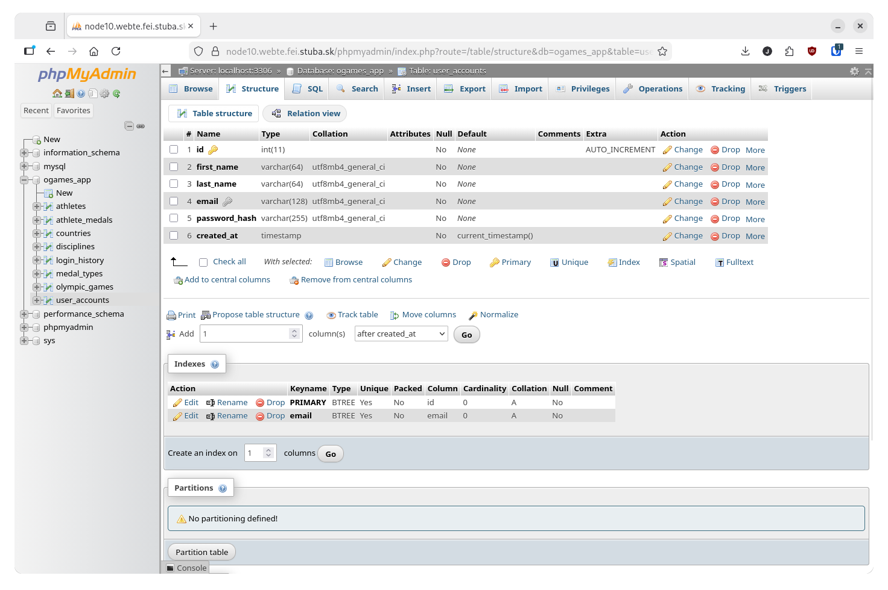
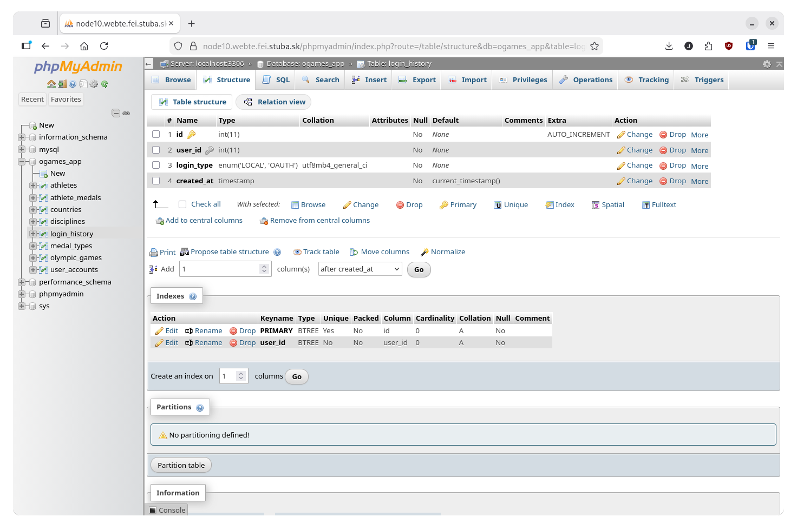

## Registrácia

Máme jednoduchú štruktúru pre používateľov, ktorú si v ďalších krokoch postupne rozšírime. V tejto podobe už ale vieme vytvoriť základné funkcie pre prácu s používateľmi: registrácia, prihlásenie-autentifikácia a odhlásenie. Vytvoríme si teda formuláre, pomocou ktorých od používateľa získame potrebné údaje.

Registračný formulár bude obsahovať všetky položky potrebné k vytvoreniu používateľa, tzn. meno, priezvisko, email a heslo. Bežnou praxou býva, že používateľ zadáva heslo dvakrát, pre eliminovanie preklepov. Tieto polia sa následne navzájom porovnávajú. 

Formuláre je samozrejme potrebné validovať na front-ende aj na back-ende. Pri zadávaní vstupov by mal byť používateľ okamžite po opustení políčka informovaný a korektnom, resp. chybnom zadaní vstupu, napr. prekočená dĺžka políčka, nesprávny formát e-mailu, nesprávne zopakovanie hesla a pod. 

```html
<form method="post">
    <label for="firstname">
        Meno:
        <input type="text" name="firs_tname" value="" id="firstname" placeholder="napr. John">
    </label>

    <label for="lastname">
        Priezvisko:
        <input type="text" name="las_tname" value="" id="lastname" placeholder="napr. Doe">
    </label>

    <br>

    <label for="email">
        E-mail:
        <input type="email" name="email" value="" id="email" placeholder="napr. johndoe@example.com">
    </label>

    <label for="password">
        Heslo:
        <input type="password" name="password" value="" id="password">
    </label>
    <label for="password_repeat">
        Heslo znova:
        <input type="password" name="password_repeat" value="" id="password_repeat">
    </label>

    <button type="submit">Vytvoriť konto</button>
</form>
```
Formulár je zadefinovaný bez argumentu `action`, prípadne iba `action=""`, čo znamená, že formulár sa odošle na tú istú adresu, na ktorej sa nachádza (napr. v skripte `register.php`). 

> V niektorých návodoch sa uvádza spôsob odoslania na rovnakú stránku prostredníctvom `action="<?php= htmlspecialchars($_SERVER['PHP_SELF']) ?>"`, čo je náchylnejšie najmä na útoky typu [*XSS - Cross Site Scripting*](https://owasp.org/www-community/attacks/xss/) (funkcia `htmlspecialchars()` práve slúži ako opatrenie proti tomuto útoku).

Takýto formulár potom vieme spracovať v rovnakom skripte, nezabudnite si importovať konfiguračný súbor pre pripojenie k databáze:

```php
// register.php
<?php

require_once __DIR__ . '/../../config.php';  // Pripojenie konfiguracneho suboru s pripojenim na DB
require_once __DIR__ . '/utils.php';  // Externy subor s funkciami isEmpty, userExist a pod...

if ($_SERVER["REQUEST_METHOD"] == "POST") {  
    // Ak bol odoslany formular - tzn. bol urobeny HTTP POST Request na tento skript...
    
    // Validacia zadania e-mailu
    if (isEmpty($_POST['email']) === true) {
        $errors .= "Nevyplnený e-mail.\n";
    }

    // TODO: validacia, zi pouzivatel zadal e-mail v korektnom formate

    // Validacia, ci pouzivatel v DB existuje - kontrolujeme stlpec e-mail, ktory sme si zadali ako UNIQUE.
    if (userExist($pdo, $_POST['email']) === true) {
        $errors .= "Používateľ s týmto e-mailom už existuje.\n";
        die();
    }

    // Valiadacia zadania mena a priezviska
    if (isEmpty($_POST['firstname']) === true) {
        $errors .= "Nevyplnené meno.\n";
    } elseif (isEmpty($_POST['lastname']) === true) {
        $errors .= "Nevyplnené priezvisko.\n";
    }

    // TODO: Implementujte validaciu dlzky mena a priezviska na zaklade dlzky, ktoru ste definovali pre stlpce v DB
    // TODO: Implementujte validaciu, ci meno a priezvisko obsahuje iba povolene znaky


    // Validacia hesla
    if (isEmpty($_POST['password']) === true) {
        $errors .= "Nevyplnené heslo.\n";
    }

    // TODO: Implementujte validaciu kontroly opakovane zadaneho hesla - kontrola, ci $_POST['password'] a $_POST['password_repeat'] su rovnake retazce.
    // TODO: Osetrite a validujte vstupy pouzivatela

    if (empty($errors)) {
        $stmt = $pdo->prepare("INSERT INTO users (first_name, last_name, email, password_hash) VALUES (:first_name, :last_name, :email, :password_hash)");

        $pw_hash = password_hash($_POST['password'], PASSWORD_ARGON2ID);

        $stmt->bindParam(":first_name", $_POST['first_name'], PDO::PARAM_STR);
        $stmt->bindParam(":last_name", $_POST['last_name'], PDO::PARAM_STR);
        $stmt->bindParam(":email", $email, PDO::PARAM_STR);
        $stmt->bindParam(":password_hash", $pw_hash, PDO::PARAM_STR);

        if ($stmt->execute()) {
            $reg_status = "Registracia prebehla uspesne.";
        } else {
            $reg_status = "Chyba pri registracii.";
        }

        unset($stmt);
    }
    unset($pdo);
}

?>

<!doctype html>
<html lang="sk">

<!-- HTML kod stranky s formularom -->

</html>
```

Ak bol skript zavolaný metódou `POST` spustí sa validácia - tentokrát back-endová - vstupov používateľa. PHP sa interpretuje na serveri a dáta z formulára sú dostupné v superglobálnej premennej `$_POST`. Je to asociatívne pole, podobne, ako keď sme parsovali CSV súbor a hodnoty, ktoré používateľ zadal sú dostupné prostredníctvom kľúčov. Kľúče tohoto poľa sú definované podľa hodnôt argumentov `name` z formulárových `input` fieldov.

**Pozor! Heslo sa do databázy ukladá vždy hashované, nikdy nie v *plain-text* podobe!** Používame na to funkciu `password_hash()`, ktorej prvým argumentom je text/heslo, ktoré má byť hashované a druhý argument je algoritmus, ktorý sa použije. V našom prípade sme špecifikovali, že heslo sa má hashovať algoritmom *Argon2ID*. Ak by sme nezadali nič, použije sa *BCrypt*. Ich popis a rozdiely sú definované v [PHP dokumentácii](https://www.php.net/manual/en/function.password-hash.php).

## Prihlasovanie

Máme spôsob vytvorenia používateľa, ale čo s tým? Potrebujeme sa teraz vedieť prihlásiť a dať aplikácii vedieť, že sme to my. Hlavným nástrojom v logike prihlasovania používateľov je *session* - relácia. V zjednodušenej podobe vieme povedať: 

> Ak sa používateľ prihlási, otvor novú reláciu - *session* a zapamätaj si identifikátor prihláseného používateľa. Pri dopyte na každú zabezpečenú stránku si najprv cez *session* over, či je používateľ prihlásený. Ak nie je, vráť ho na stránku prihlásenia. Ak je prihlásený, zobraz mu obsah dostupný len pre prihlásených. V prípade odhlásenia používateľa zruš *session*.

Prihlásenie používateľa na stránku spočíva vo vytvorení takejto relácie. Na to slúži funkcia `session_start()`, ktorá okrem vytvorenia *session* umožňuje získať prístup k otvorenej *session* na inej podstránke. Prihlasovanie vyžaduje jednoduchý formulár - môže byť napr. v skripte `login.php`, ktorý bude odkazovať sám na seba, podobne ako registrácia.

Skript najprv otvorí *session* a skontroluje, či je používateľ prihlásený. To je ošetrenie prípadu, ak by prihlásený používateľ manuálne do URL zadal cestu k `login.php` skriptu. Vtedy ho nepotrebujeme nanovo prihlasovať. Jednoducho mu zobrazíme hlavnú stránku alebo zabezpečenú stránku.

Login je vlastne obyčajný `SELECT` údajov z databázy, z ktorých potrebujeme získať najmä hash hesla za predpokladu, že používateľ existuje. Používateľa vyberáme na základe zadaného jedinečného identifikátora - mailu vo formulári. 

Takým vhodným návykom by bolo mať aplikáciu, ktorá je "skeptická". To znamená, že neposkytuje o sebe zbytočne podrobné informácie a pokiaľ to nie je dovolené, poskytne iba minimum informácii. Ide najmä o logiku prihlasovania:

1. Najprv zisti, či používateľ so zadaným identifikátorom existuje. Ak nie, vráť informáciu o nesprávne zadaných údajoch (nepovieme, že používateľ neexistuje)
2. Ak používateľ existuje, zisti, či zadal správne heslo. Ak nie, vráť informáciu o nesprávne zadaných údajoch (nepovieme, že konkrétne heslo je nesprávne)
3. Ak sú splnené prvé dve podmienky, až následne vráť a ulož informácie o používateľovi.

Vráťme sa k overeniu hesla. Slúži na to funkcia `password_verify()`, ktorej prvým argumentom je používateľom zadané heslo, ktoré chceme overiť a druhý argument je hash hesla (väčšinou z databázy), voči ktorému sa heslo overuje (vytvorený funkciou `password_hash()` alebo `crypt()`). Toto porovnanie funguje na princípe porovnania dvoch reťazcov, hash sa **nedešifruje**. Podrobnejšie [v dokumentácii PHP](https://www.php.net/manual/en/function.password-verify.php).

Akonáhle sme autentifikovaný, môžeme si do *session* uložiť potrebné informácie o používateľovi, v tomto prípade je to *flag* `loggedin`, pre indikáciu prihláseného používateľa `full_name` - zložené z reťazcov mena a priezviska, `email` používateľa a `created_at` - dátum prihlásenia. V tomto mieste môžeme tiež zavolať funkciu, ktorá nám vytvorí nový záznam o prihlásení používateľa, keďže poznáme všetky potrebné údaje: (`id`, `login_type` je `LOCAL` a čas sa vyplní automaticky v momente vloženia).

Zvyšok skriptu je, dúfajme, jednoznačný. 

```php
// login.php
<?php
session_start();
// Ak je pouzivatel uz prihlaseny, presmeruj ho na index alebo restricted. 
// Nie je potrebne znovu vyplnat formular. 
if (isset($_SESSION["loggedin"]) && $_SESSION["loggedin"] === true) {
    header("location: restricted.php");
    exit;
}

require_once __DIR__ . "/../../config.php";

if ($_SERVER["REQUEST_METHOD"] == "POST") {

    // TODO: Implementovat osetrenie vstupov formulara

    $sql = "SELECT id, first_name, last_name, email, password_hash, created_at FROM users WHERE email = :email";
    $stmt = $pdo->prepare($sql);
    $stmt->bindParam(":email", $_POST["email"], PDO::PARAM_STR);
    $errors = "";

    if ($stmt->execute()) {
        if ($stmt->rowCount() == 1) {
            // Pouzivatel existuje, skontroluj, ci zadal spravne heslo
            $row = $stmt->fetch();
            $hashed_password = $row["password"];
            
            if (password_verify($_POST['password'], $hashed_password)) {
                    // Heslo sa zhoduje, pouzivatel je autentifikovany
                    // Do session superglobal uloz potrebne udaje
                    $_SESSION["loggedin"] = true;
                    $_SESSION["full_name"] = $row['first_name'] . " " . $row['last_name'];
                    $_SESSION["email"] = $row['email'];
                    $_SESSION["created_at"] = $row['created_at'];


                    // TODO: Implementujte funkciu pre pridanie zaznamu o prihlaseni do tabulky login_history
                    // kedze pozname aj ID pouzivatela, sposob prihlasenia je LOCAL, cas a datum prihlasenia sa nam vytvori automaticky.


                    // Presmeruj pouzivatela na stranku s obsahom pre prihlasenych
                    header("location: restricted.php");
            } else {
                $errors = "Nesprávne meno alebo heslo.";
            }
        } else {
            $errors = "Nesprávne meno alebo heslo.";
        }
    } else {
        $errors = "Chyba prihlásenia";
    }

    unset($stmt);
    unset($pdo);
}
?>

<!doctype html>
<html lang="sk">

<!-- Zvysok HTML template -->

<main>
    <form action="" method="post">

        <label for="email">
            E-Mail:
            <input type="text" name="email" value="" id="email" required>
        </label>
        <br>
        <label for="password">
            Heslo:
            <input type="password" name="password" value="" id="password" required>
        </label>

        <button type="submit">Prihlásiť sa</button>

        <!-- TODO: Implementacia funkcionality "zabudol som"/"resetovať heslo" -->

    </form>
    <p>Nemáte vytvorené konto? <a href="register.php">Zaregistrujte sa tu.</a></p>
</main>
</body>
</html>
```

## Zabezpečené stránky a odhlásenie

Vytvoríme si jednoduché skripty `restricted.php` a `index.php`:

`restricted.php` bude reprezentovať nejakú "stránku alebo obsah dostupný iba po prihlásení", čiže spôsob, ako overovať prihláseného používateľa (ktorý môžeme použiť aj na ďalšie podstránky)

`index.php` bude reprezentovať vstupný bod aplikácie kde:
- ak je používateľ neprihlásený, zobrazí sa mu odkaz na registračný alebo prihlasovací formulár.
- ak je používateľ autentifikovaný, zobrazí sa mu jeho identifikátor, meno a odkaz na obsah dostupný prihláseným používateľom.

Základ zobrazenia stránky, ktorá zobrazuje údaje z aktuálnej relácie je nasledovný. Príkazom `session_start()` začneme alebo pokračujeme v začatej relácii. Následne skotrolujeme, či v superglobálnej premennej `$_SESSION` máme nastavené premenné používateľa, ktoré sme si nastavili pri prihlásení. Najprv kontrolujeme *flag* `loggedin`. Ak nie je nastavený alebo jeho hodnota je `false`, automaticky presmerujeme používateľa na stránku s prihlasovacím formulárom. 

Ak je používateľ prihlásený, zobrazíme mu obsah stránky s údajmi, ktoré sú uložené v superglobálnej premennej `$_SESSION` (meno, email a pod...).
```php
// restricted.php
<?php

session_start(); 

if (!isset($_SESSION["loggedin"]) || $_SESSION["loggedin"] !== true) {
    header("Location: login.php");
    exit;
}

?>

<!doctype html>
<html lang="sk">

    <!-- Zvysok HTML template -->

    <main>
        <h3>Vitaj <?php echo $_SESSION['full_name'] ?></h3>
        <p><strong>e-mail:</strong> <?php echo $_SESSION['email']; ?></p>
        
        <p><strong>Si prihlásený cez lokálne údaje.</strong></p>
        <p><strong>Dátum vytvonia konta:</strong> <?php echo $_SESSION['created_at'] ?></p>

        <p><a href="logout.php">Odhlásenie</a> alebo <a href="index.php">Úvodná stránka</a></p>

    </main>
</body>

</html>
```

> Podobne, ako pri prihlasovacom formulári a zabezpečenej stránke, môžeme pridať kontrolu *session* premennej `loggedin` aj na stránku s registračným formulárom. A teda ak je používateľ prihlásený, nesmie vidieť registračný formulár. Presmerujeme ho napríklad na `index.php`.

Na stránke `index.php` budeme rozlišovať dve situácie a na základe toho zobrazíme adekvátny obsah. Vidíme, že PHP kód môžeme volať aj uprostred dokumentu, nie len na začiatku. Výhodné je to obzvlášť pri stránkach, ktoré majú obsah závislý na nejakých podmienkach. Otvoríme *session* a podľa toho, či je používateľ prihlásený mu zobrazíme relevantné odkazy.

```php
// index.php
<!doctype html>
<html lang="sk">

<!-- Zvysok HTML template -->

<body>
    <main>

        <?php
        session_start();

        if (!isset($_SESSION["loggedin"]) || $_SESSION["loggedin"] !== true ) {
            // Pouzivatel nie je prihlaseny, zobraz odkazy na prihlasovaci a registracny formular.
            echo '<p>Pre pokračovanie sa prosím <a href="login.php">prihláste</a> alebo sa <a href="register.php">zaregistrujte</a>.</p>';
        } else {
            // Pouzivatel je prihlaseny, zobraz jeho meno a odkazy na zabezpecene stranky.
            echo '<h3>Vitaj ' . $_SESSION['full_name'] . ' </h3>';
            echo '<a href="restricted.php">Zabezpečená stránka</a>';
        }

        ?>
    </main>
</body>

</html>
```

Najjednoduchšia logika je pre odhlásenie, kde potrebujeme zrušiť *session* premenné a presmerovať používateľa na hlavnú stránku:

```php
<?php
session_start();
// Uvolnenie session premennych. Nasledujuce dva prikazy su ekvivalentne a staci pouzit jeden.
$_SESSION = array();
session_unset();

session_destroy();  // Vymazanie session 
header("location: index.php");  // Presmerovanie na inu stranku.
exit;  // Ukoncenie vykonavania PHP skriptu.
```

## Inštalácia závislostí a balíkov

Pre implementáciu dvojfaktorového overenia a prihlasovania prostredníctvom OAuth2 využijeme externé knižnice. Tieto knižnice si bude potrebné nainštalovať lokálne a následne aj na serveri (pokiaľ ich neskopírujete z lokálneho prostredia). 

V prostredí jazyka PHP existujú rozličné knižnice a je možné ich používať tak, že si ich zdrojový kód stiahneme manuálne z repozitáru vývojára konkrétnej knižnice, alebo si ich nainštalujeme prostredníctvom správcu balíkov. Podobne, ako NodeJS má `npm` pre správu a inštaláciu balíkov, pre PHP knižnice existuje správca balíkov `composer`. Je to jednoduchý skript, ktorý využíva verejný register balíkov, a takmer všetky PHP balíky je možné nainštalovať pomocou tohoto manažéra.

`composer` je potrebné pred použitím najprv stiahnuť [z oficiálnej stránky](https://getcomposer.org/download/) a nainštalovať. Na stránke sa nachádzajú príkazy pre prostredie, v ktorom je nainštalovaný PHP interpreter (napr. váš školský server, prípadne ho viete nainštalovať aj do Docker stacku - pozri doplnený [setup lokálneho Docker prostredia](cv1/setup-docker.md))

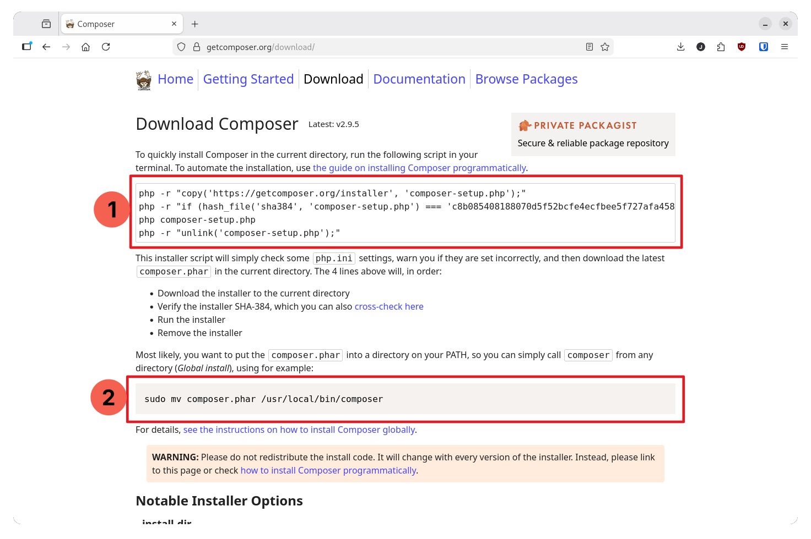

1. Príkazy pre inštaláciu `composer` je potrebné spúšťať jeden po druhom, nie všetky naraz, v prípade, že `composer` inštalujete na server.
2. Aby sme ho mohli používať globálne, ako systémový príkaz, presunieme ho do adresára `/usr/local/bin/`, z ktorého je dostupný aj z iných adresárov (napr. `/var/www/...`).

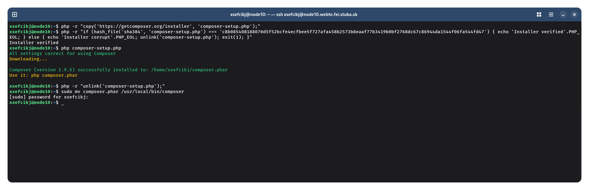

Hotovú inštaláciu môžeme overiť zavolaním príkazu `composer`:

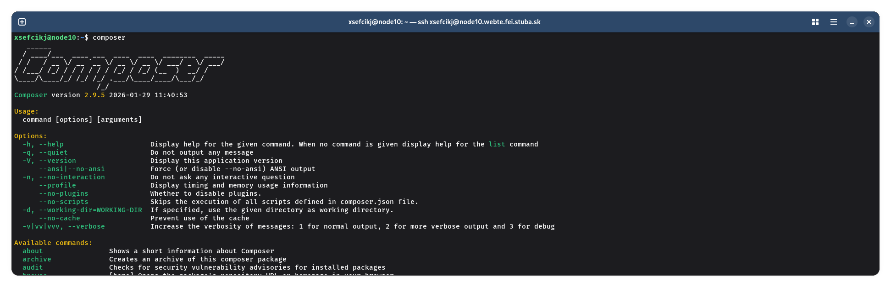

Nezabudnite do README uviesť všetky zmeny, ktoré ste na serveri robili, vrátane inštalácie balíkov, závislostí, knižníc a pod. Keď máme `composer` nainštalovaný, môžeme veselo inštalovať knižnice pre PHP.

Pomocou `composer` si nainštalujeme knižnice pre implementáciu dvojfaktorového overenia a pre implementáciu OAuth2 cez Google účet. Inštaláciu budeme robiť do adresára `/var/www/nodeXX.webte.fei.stuba.sk/ADRESAR_PROJEKTU/` - namiesto `ADRESAR_PROJEKTU` si **zadajte váš adresár, v ktorom bude implementované zadanie!** Budeme používať:
- [2FA knižnica](https://github.com/RobThree/TwoFactorAuth) - knižnica pre 2FA
- [Bacon QR Code](https://github.com/Bacon/BaconQrCode) - knižnica pre generovanie QR kódov pre 2FA
- [Google PHP API Client Library](https://github.com/googleapis/google-api-php-client) - knižnica pre prácu s Google API službami

Nainštalujeme ich príkazmi:
```sh
composer require robthree/twofactorauth
composer require bacon/bacon-qr-code ^2
composer require google/apiclient
```

Všimnime si, že nám v adresári vznikol priečinok `vendor` a takisto aj súbor `composer.json` (a `.lock`). V adresári `vendor` sa nachádzajú zdrojové súbory knižníc a aj súbor `autoload.php` pomocou ktorého ich importujeme do skriptov, v ktorých s nimi pracujeme. Súbor `composer.json` má podobný význam ako `package.json` alebo `node_modules.json` pri NodeJS - ukladá verzie a závislosti nainštalovaných knižníc a pomocou neho môžeme tieto závislosti kdekoľvek nainštalovať alebo aktualizovať.

> Pri odovzdávaní zadania **nesmie ZIP archív obsahovať adresár `vendor`!** Archív zadania **musí obsahovať súbor `composer.json`!**

Nevýhodou Google API knižníc je, že ich je veľa a v tomto prípade potrebujeme jednu z 324 (ish) inštalovaných knižníc. Aby sme to obmedzili, upravíme súbor `composer.json` tak, aby nepotrebné vymazal. V textovom editore (napr. `nano`) upravíme nasledovne:

```json
{
    "require": {
        "robthree/twofactorauth": "^3.0",
        "google/apiclient": "^2.19",
        "bacon/bacon-qr-code": "^2.0",
    },
    "scripts": {
        "pre-autoload-dump": "Google\\Task\\Composer::cleanup"
    },
    "extra": {
        "google/apiclient-services": [
            "Oauth2"
        ]
    }
}
```

Teraz zavoláme príkaz `composer update` ktorým sa vymažú nepotrebné Google API knižnice a ostane nám iba knižnica pre OAuth2. 

Adresár `vendor` by nemal byť prístupný z webového prehliadača. Na tento účel si môžeme do Nginx *Virtual Host Configuration* doplniť pravidlo, ktoré k nemu explicitne zakazuje prístup:

```conf
...
location ~* /vendor/ {
    deny all;
    return 403;
}
...
```
> Súbor `composer.json` pre beh stránok nie je potrebný. Preto sa musí nachádzať v odovzdanom ZIP archíve a vo vašom lokálnom/remote repozitári, kde máte vývojovú verziu aplikácie - slúži na aktualizáciu a reinštaláciu existujúcich balíkov. V produkčnom prostredí nemá čo robiť a pri nasadzovaní riešenia na server **ho nezabudnite zo serveru vymazať**.

## Implementácia 2FA 

Pre implementáciu dvojfaktorového overenia využijeme funkcie a súbory vytvorené v predchádzajúcich krokoch a rozšírime ich o logiku:

1. generovania kódu pre zapnutie 2FA,
2. generovanie QR kódu pre ľahšie skenovanie do aplikácie TOTP autentifikátora,
3. zapnutie 2FA pri registrácii používateľa,
4. overenie prihlasovaného používateľa prostredníctvom TOTP kódu.

V prvom rade je potrebné každému používateľovi priradiť kód, ktorý sa bude používať na dvojfaktorové overenie. Možných implementácii je viacero - rozšírenie existujúcej tabuľky a potrebné stĺpce, vytvorenie novej tabuľky pre ukladanie 2FA údajov a pod. 

Najjednoduchším riešením je, že pridáme jeden nový stĺpec do tabuľky `user_accounts`, nazveme ho napr `tfa_secret` a určíme mu dátový typ `VARCHAR(255)`. Následne upravíme kód registračného formuláru, ktorým sa vytvára nový používateľ. Na konci, po odoslaní formulára a úspešnej registrácii môžeme používateľovi zobraziť kód pre autentifikačnú aplikáciu a QR kód, pomocou ktorého ho jednoducho naskenuje.

```php
// register.php
<?php

session_start();
if (isset($_SESSION["loggedin"]) && $_SESSION["loggedin"] === true) {
    header("location: index.php");
    exit;
}

require_once 'vendor/autoload.php';  // Nacitanie kniznice

use RobThree\Auth\Providers\Qr\BaconQrCodeProvider;  // Cesta pre triedu providera generatora QR kodu.
use RobThree\Auth\TwoFactorAuth;  // Cesta pre triedu generovania 2FA kodu.

// ... Logika validacie a pod...

$stmt = $pdo->prepare(
    "INSERT INTO users (first_name, last_name, email, password_hash, tfa_secret) 
    VALUES (:first_name, :last_name, :email, :password_hash, :tfa_secret)"
);

$pw_hash = password_hash($_POST['password'], PASSWORD_ARGON2ID);

// Vytvorenie 2FA kodu a konstruktora kniznice pre QR kod.
// Pripadne zmeny alebo personalizaciu pozri: https://robthree.github.io/TwoFactorAuth/
$tfa = new TwoFactorAuth(new BaconQrCodeProvider(4, '#ffffff', '#000000', 'svg'));
$user_secret = $tfa->createSecret(); // Vygenerovanie kodu, ktory sa ulozi do databazy.
// Vygenerovanie QR kodu pre naskenovanie mob. aplikaciou pre TOTP, napr. Google Authenticator a pod.
$qr_code = $tfa->getQRCodeImageAsDataUri('Olympic Games APP', $user_secret);  

$stmt->bindParam(":first_name", $_POST['first_name'], PDO::PARAM_STR);
$stmt->bindParam(":last_name", $_POST['last_name'], PDO::PARAM_STR);
$stmt->bindParam(":email", $email, PDO::PARAM_STR);
$stmt->bindParam(":password_hash", $pw_hash, PDO::PARAM_STR);
$stmt->bindParam(":tfa_secret", $user_secret, PDO::PARAM_STR);

if ($stmt->execute()) {
    $reg_status = "Registracia prebehla uspesne.";
} else {
    $reg_status = "Chyba pri registracii.";
}
// ... 
?>

<!doctype html>
<html lang="sk">

    <!-- Zvysok HTML template -->

    <?php
    if (isset($qr_code)) {
        // Ak sme po uspesnej registracii vygenerovali QR kod, zobrazime ho na stranke
        $message = '<p>Zadajte kód: ' . $user_secret . ' do aplikácie pre 2FA</p>';
        $message .= '<p>alebo naskenujte QR kód:<br></p>';
        echo $message;
        echo '<p>Teraz sa môžete prihlásiť: <a href="login.php">Login stránka</a></p>';
    }
    ?>
    </main>
</body>

</html>
```

Tento kód je dobré si buď hneď zadať do aplikácie alebo naskenovať telefónom. V opačnom prípade, by ste ho museli hľadať v databáze a prepisovať znova ručne.

Po úspešnej registrácii a vytvorení "druhého faktoru" overenia používateľa musíme takisto upraviť prihlasovací formulár, aby využíval novú funkcionalitu. Do pôvodného postupu autentifikácie teda doplníme jeden krok navyše:

1. Zisti, či používateľ existuje,
2. Ak používateľ existuje, zisti, či zadal správne heslo. 
3. Ak používateľ zadal správne heslo, over, či zadal korektný kód pre 2FA.
4. Ak sú splnené predchádzajúce tri podmienky, používateľ je autentifikovaný. 

Adekvátne k tejto logike upravíme stránku pre prihlásenie:

```php
// login.php
<?php
session_start();
// Ak je pouzivatel uz prihlaseny, presmeruj ho na index alebo restricted. 
// Nie je potrebne znovu vyplnat formular. 
if (isset($_SESSION["loggedin"]) && $_SESSION["loggedin"] === true) {
    header("location: restricted.php");
    exit;
}

require_once __DIR__ . "/../../config.php";
require_once 'vendor/autoload.php';

use RobThree\Auth\Providers\Qr\EndroidQrCodeProvider;
use RobThree\Auth\TwoFactorAuth;

// ...

if (password_verify($_POST['password'], $hashed_password)) {
    // Heslo sa zhoduje, skontroluj 2FA    
    // Inicializuj kniznicu pre overenie zadaneho kodu            
    $tfa = new TwoFactorAuth(new EndroidQrCodeProvider());
    // Treti argument metody verifyCode je tzv. discrepancy - urcuje nasobok casu kolko bude platit generovany kod.
    // Standardne su kody generovane kazdych 30 sekund a rovnaky cas su aj platne. Tym, ze nastavime 
    // discrepancy na 2, umoznime zadat generovany 6 ciselny TOTP kod 60 sekund.
    if ($tfa->verifyCode($row["tfa_secret"], $_POST['totp'], 2)) {
        // Kod aj heslo sa zhoduju, pouzivatel je autentifikovany    

        // Do session superglobal uloz potrebne udaje
        $_SESSION["loggedin"] = true;
        $_SESSION["full_name"] = $row['first_name'] . " " . $row['last_name'];
        $_SESSION["email"] = $row['email'];
        $_SESSION["created_at"] = $row['created_at'];


        // TODO: Implementujte funkciu pre pridanie zaznamu o prihlaseni do tabulky login_history
        // kedze pozname aj ID pouzivatela, sposob prihlasenia je LOCAL, cas a datum prihlasenia sa nam vytvori automaticky.


        // Presmeruj pouzivatela na stranku s obsahom pre prihlasenych
        header("location: restricted.php");
    } else {
        $errors = "Nesprávne pirhlasovacie údaje";
    }
} else {
    $errors = "Nesprávne pirhlasovacie údaje";
}
        
//...
?>

<!doctype html>
<html lang="sk">

<!-- Zvysok HTML template -->

<main>
    <form action="" method="post">

        <label for="email">
            E-Mail:
            <input type="text" name="email" value="" id="email" required>
        </label>
        <br>
        <label for="password">
            Heslo:
            <input type="password" name="password" value="" id="password" required>
        </label>
        <label for="totp">
            Kód pre 2FA:
            <input type="text" name="totp" value="" id="totp" required>
        </label>

        <button type="submit">Prihlásiť sa</button>

        <!-- TODO: Implementacia funkcionality "zabudol som"/"resetovať heslo" -->

    </form>
    <p>Nemáte vytvorené konto? <a href="register.php">Zaregistrujte sa tu.</a></p>
</main>
</body>
</html>
```

## Implementácia OAuth2 cez Google API

Kompletnú dokumentáciu, z ktorej čerpáme môžeme nájsť [na oficiálnych stránkach Google pre vývojárov](https://developers.google.com/identity/protocols/oauth2) spolu s názorným vysvetlením, ako funguje OAuth2. V prípade riešenia chýb je dobré začať touto dokumentáciou a pochopiť, ako mechanizmus overovania identity funguje. 

Nebola by to služba od Google, keby jej implementácia nezahŕňala nejaké extra kroky navyše a nastavovanie miliónov oprávnení... Tak, ako pri iných službách Google API, aj tentoraz je potrebné vytvoriť a nakonfigurovať si projekt v Google konzole. Prihláste sa do Google Cloud konzoly a vytvorte si nový projekt.

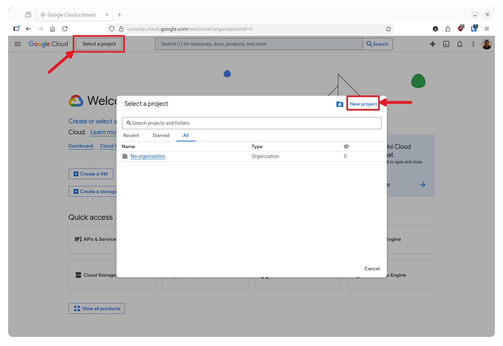

Zadajte si zmysluplný pekný názov a zadajte vytvoriť.

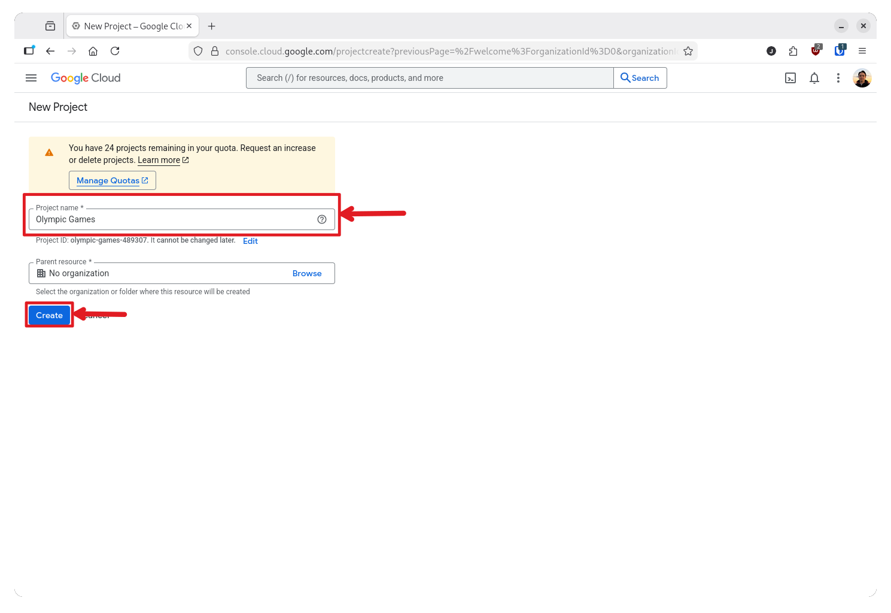

Po vytvorení môžete nový projekt zvoliť a otvorí sa vám prehľad projektu. Otvorte si vľavo navigačné menu, nájdite položku "*APIs & Services*" a v nej kliknite na možnosť "*OAuth consent screen*"

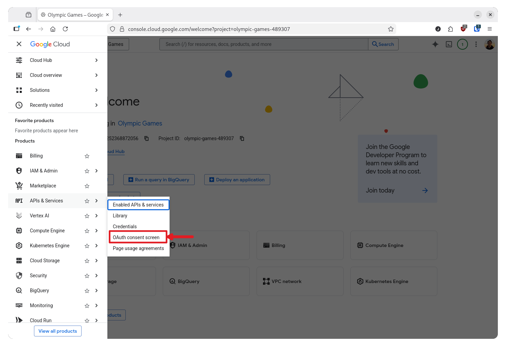

Otvorí sa vám stránka s prehľadom a konfiguráciou Google Auth Platform. V tejto časti je potrebné nakonfigurovať tzv. "*OAuth consent screen*" - tzv. zobrazenie pre koncového používateľa s informáciou, čo všetko pri prihlásení poskytuje jeho Google účet tretej strane (aplikácii do ktorej sa prihlasuje).

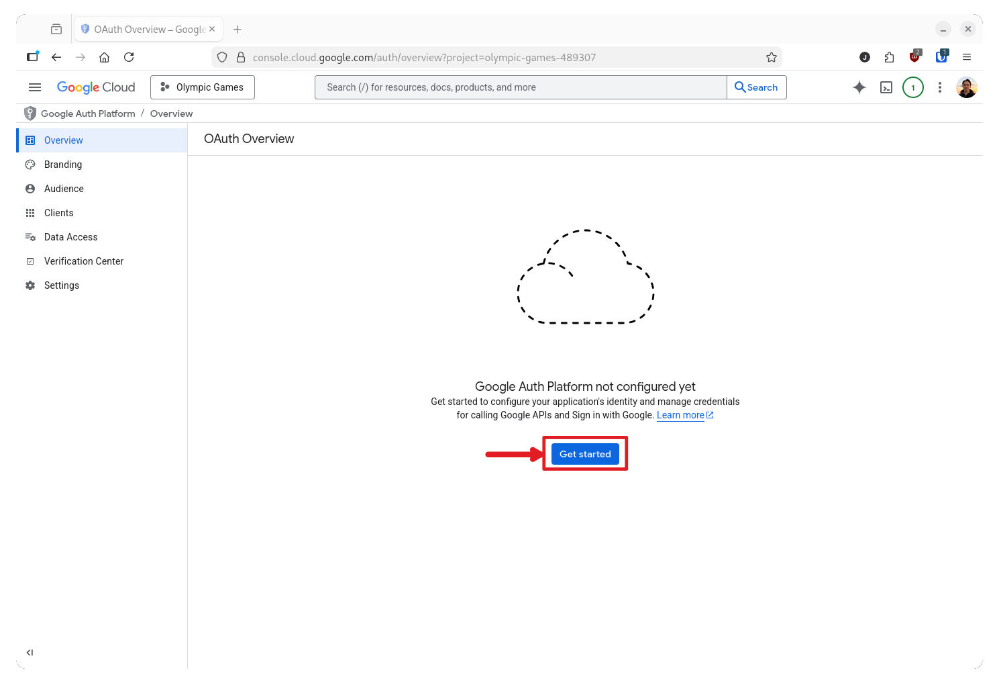

Je potrebné prejsť procesom nastavenia požadovaných údajov: vyplnenie názvu aplikácie, zadanie mailu pre podporu (vyberiete váš e-mail z rozbaľovacieho zoznamu) - to je e-mail, s ktorým je aplikácia vytváraná. Slúži na to, aby používatelia mali kam posielať sťažnosti, že niečo nefunguje.

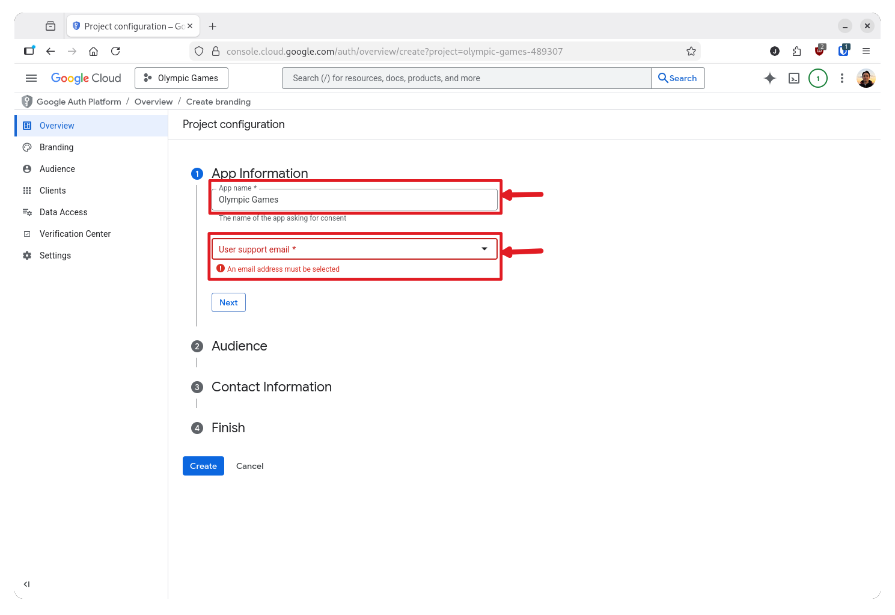

V ďalšom kroku nastavujeme, pre koho je aplikácia určená. Máme na výber z možností "*Internal*" a "*External*". Zvoľte "*External*", čím umožníte akémukoľvek používateľovi s Google účtom prihlásiť sa do aplikácie. 

> Tento proces nastavenia je možné robiť aj v Cloud konzole STUBA účtu Google. Ak by ste v tom prípade zvolili v tomto kroku "*Internal*", do aplikácie sa bude možné prihlásiť iba pomocu účtu STUBA, pretože všetky projekty, vytvorené pod STUBA kontom sú automaticky priradené do nadradenej organizácie (STU).

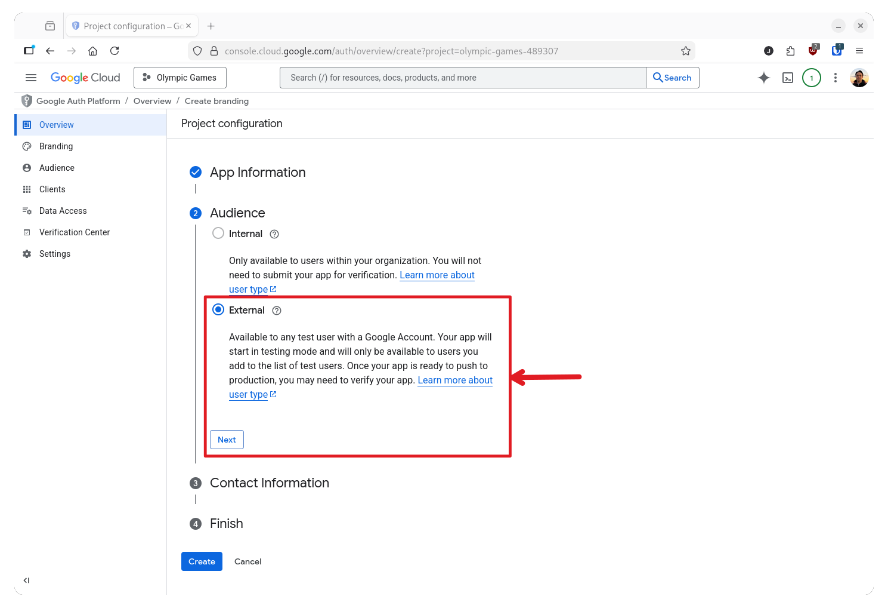

V predposlednom kroku je nutné zadať kontaktné maily, na ktoré Google posiela informácie o zmenách v projekte (nebudú žiadne, je to skrátka povinný údaj). Na toto miesto by napr. išli e-maily vývojárov alebo tímu, ktoré vyvíjajú danú aplikáciu.

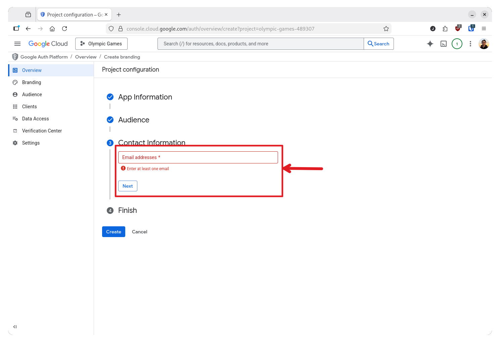

V poslednom kroku je potrebné súhlasiť s podmienkami Google API služieb a môžeme pokračovať.

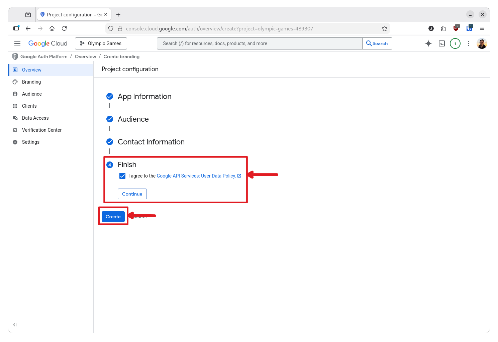

Teraz môžeme vytvoriť OAuth klienta, ktorý bude zabezpečovať autentifikáciu v našej aplikácii. V ľavom menu si zvolíme položku *"Clients"* a vytvoríme nového klienta. Opäť sa budeme musieť preklikať konfiguračnými obrazovkami.

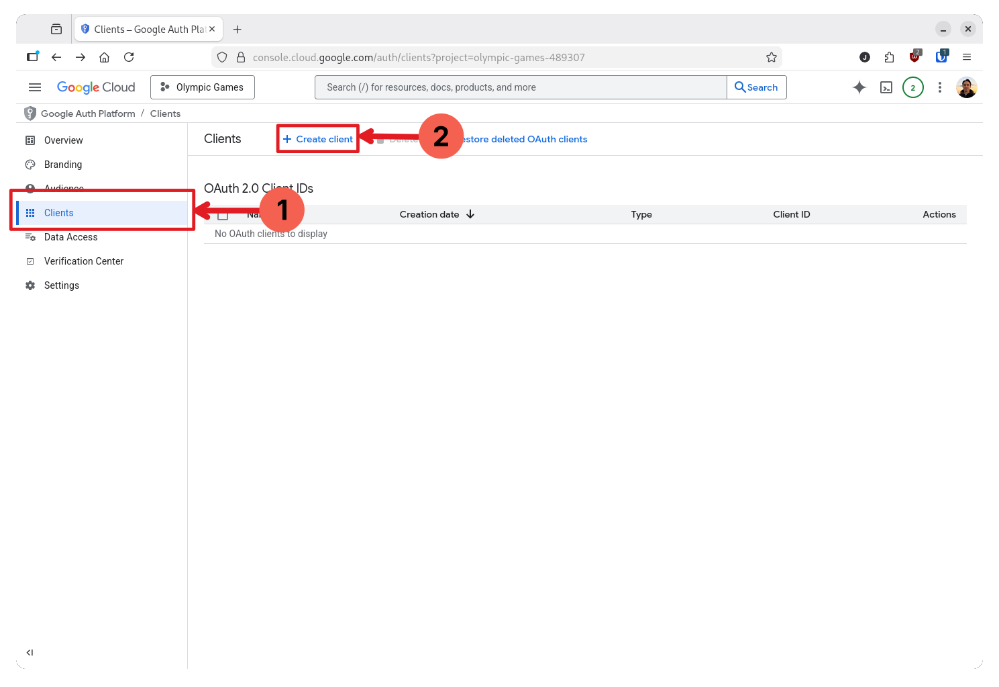

Následne môžeme nakonfigurovať OAuth klienta:

1. Zvolíme typ aplikácie - webová aplikácia.
2. Názov klienta, zvolíme si niečo bez medzier a diakritiky - slúži to na identifikáciu v Google Cloud konzole.
3. Autorizované URI pre presmerovanie - na tieto adresy bude používateľ **presmerovaný po úspešnej autentifikácii Google kontom**. Na túto URI následne Google prilepí autorizačný kód pre prístup k údajom Google účtu. Môžeme zadať aj viacero adries. Nesmú to byť IP adresy ale doménové mená a musí byť zadaný protokol (HTTP/HTTPS). Táto URI nesmie obsahovať fragmenty, wildcards alebo relatívne cesty. V tomto prípade to bude cesta k skriptu `oauth2callback.php` ktorý si vytvoríme a uložíme do aresára `/var/www/nodeXX.webte.fei.stuba.sk/ADRESAR` - namiesto `ADRESAR` si zadajte samozrejme názov adresára s vašim projektom.
4. Vytvoríme klienta.

> *Redirect URI* je možné hocikedy zmeniť alebo upraviť. Efekt sa ale môže prejaviť až neskôr. Ak niečo nefunguje, Google to väčšinou vypíše priamo v prehliadači, kde je chyba a je potrebné si skontrolovať, či presmerujem používateľa naozaj tam, kam som zadal v Google konzole.

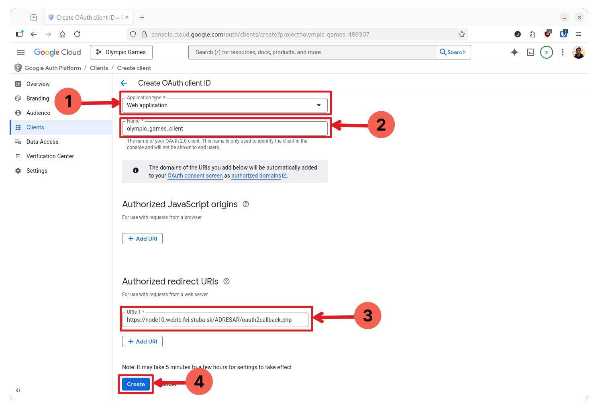

Po vytvorení klienta na nás vyskočí dialógové okno s informáciami. **Dajte si pozor a nezatvárajte ho**. Kliknite na *"Download JSON"*, ktorým stiahneme konfiguráciu, ktorú budeme potrebovať pri implementácii. Tento JSON si uložte niekde mimo prístupu Nginx serveru ale zároveň tak, aby sme k nemu mohli v PHP skriptoch pristupovať. Ideálne umiestnenie je na úroveň súboru `config.php`, v ktorom je logika pripojenia k DB - ak ste postupovali podľa predchádzajúceho postupu, tento súbor by sa mal nachádzať vo `/var/www`. 

> Keď budete mať priestor, prejdite si možnosti v rozhraní OAuth klienta. Dostanete sa takmer k všetkým nastaveniam, ktoré sme teraz vykonali. V prípade, že ste zatvorili dialógové okno, viete JSON súbor stiahnuť dodatočne aj odtiaľto.

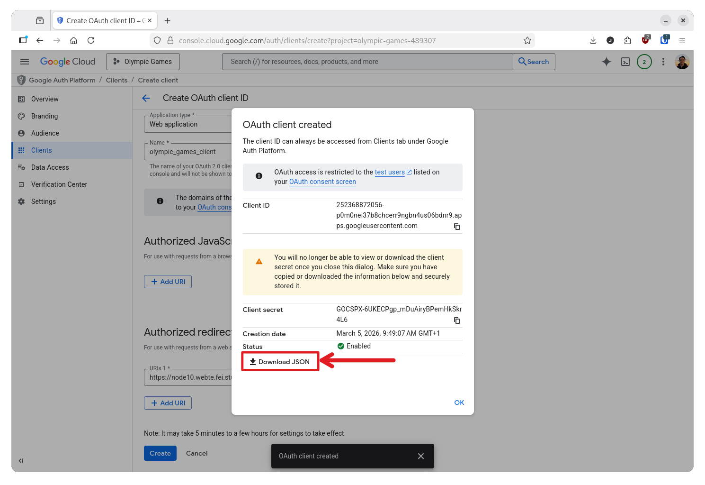

V poslednom kroku potrebujeme už len vybrať údaje, ktoré budeme od používateľa chcieť. V ľavom menu si nájdeme položku *"Data Access"*, kde môžeme vyberať tzv. *"scopes"* alebo rozsah údajov z Googlom definovaných množín. Nám stačia prvé tri, teda e-mail, profil a openid. Zaškrtneme ich a aktualizujeme. Nezabudnite zmeny v rozhraní *"Data Access"* po pridaní *"scopes"* na konci stránky uložiť.

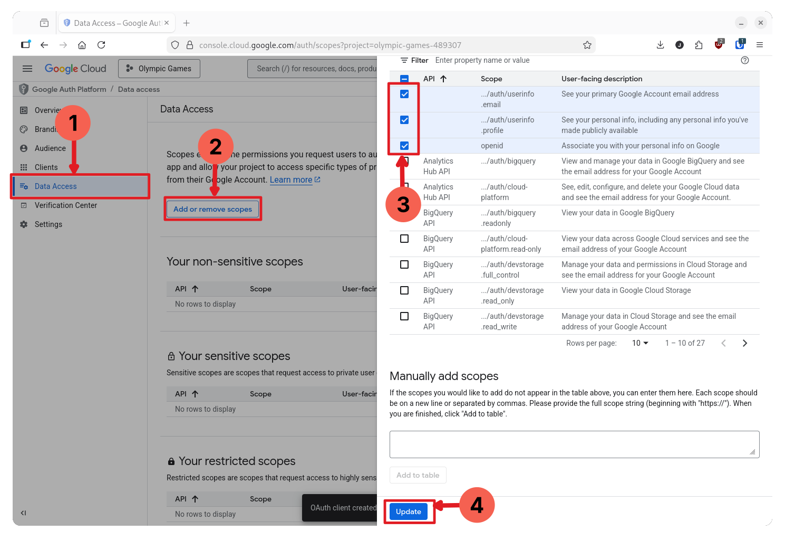

Týmto máme konfiguráciu Google Cloud konzoly hotovú. Teraz môžeme implementovať samotný PHP skript pre Google prihlásenie.

> Kompletný návod aj pre iné knižnice je možné nájsť v [oficiálnej dokumentácii Googlu](https://developers.google.com/identity/protocols/oauth2/web-server).

Vytvoríme si skript `oauth2callback.php`, ktorý sme si v Google Cloud konzole nastavili ake URI pre presmerovanie po autentifikácii. Tento skript bude zároveň slúžiť aj v prípade, že používateľ autentifikovaný nie je, aby sa mohol prihlásiť prostredníctvom Google účtu.

```php
// oauth2callback.php
<?php

session_start();

require_once 'vendor/autoload.php';
require_once '../../config.php';

use Google\Client;

$client = new Client();

// Povinne, zavolanie funkcie setAuthConfig pre nastavenie cesty s autorizacnymi udajmi OAuth klienta 
// ktore sa nachadzaju v client_secret.json subore. Subor je mozne stiahnut z Google Cloud konzoly.
$client->setAuthConfig('../../client_secret.json');
$redirect_uri = "ENTER_YOUR_REDIRECT_URI_HERE"; // Zadajte URI pre presmerovanie z OAuth2. Musi suhlasit s URI zadanym v Google Cloud konzole.
$client->setRedirectUri($redirect_uri);

// Povinne, zavolanie funkcie addScope pre ziskanie pozadovaneho rozsahu udajov.
// Mame pravo len na udaje, ktore sme povolili v konfiguracii klienta v Google konzole.
// Scopes definuju uroven pristupu a rozsahu udajov, ktore aplikacia pozaduje od Google.
$client->addScope(["email", "profile"]);
// Povolenie inkrementalnej autorizacie. Odporucane ako best practice.
$client->setIncludeGrantedScopes(true);

// Odporucane, offline pristup nam poskytne acces token a refresh token, ktore vieme pouzit 
// na obnovenie pristupu aj bez nutnej interakcie a zasahu pouzivatela.
$client->setAccessType("offline");

// Vygenerovanie URL pre autorizaciu, pokial neobsahuje uz autorizacny kod alebo chybovu hlasku
if (!isset($_GET['code']) && !isset($_GET['error'])) {
    // Generovanie a nastavenie state premennej
    $state = bin2hex(random_bytes(16));
    $client->setState($state);
    $_SESSION['state'] = $state;

    // Generovanie URL, ktora vyziada od pouzivatela opravnenie na poskytnutie udajov.
    $auth_url = $client->createAuthUrl();
    header('Location: ' . filter_var($auth_url, FILTER_SANITIZE_URL));
}

// Pouzivatel autorizoval poziadavku a bol nam vrateny autorizacnykod na výmenu za pristupovy token a obnovovaci token.  
// Ak parameter state nie je nastavený alebo sa nezhoduje s parametrom state v autorizacnej poziadavke,
// je mozne, ze poziadavku vytvorila tretia strana a pouzivatel bude presmerovaný na URL s chybovou správou.  
// Ak bola autorizacia uspesna, URI odpovede bude obsahovat autorizacny kod.
if (isset($_GET['code'])) {
    // Skontroluj hodnotu state.
    if (!isset($_GET['state']) || $_GET['state'] !== $_SESSION['state']) {
        die('State mismatch. Possible CSRF attack.');
    }

    // Ziskaj pristupovy a obnovovaci token (ak access_type je nasteveny na offline)
    $token = $client->fetchAccessTokenWithAuthCode($_GET['code']);

    // Ulozenie pristupoveho a obnovovacieho tokenu do session
    // TODO: Na produkcnom prostredi by sme si to mali ulozit do nejakeho perzistentneho uloziska, napr. databaza
    $_SESSION['access_token'] = $token;
    $_SESSION['refresh_token'] = $client->getRefreshToken();

    $_SESSION['loggedin'] = true;  // Pouzivatel je autentifikovany a teda prihlaseny, nastav premennu session.

    // TODO: na tomto mieste je potrebne ulozit informaciu o prihlaseni pouzivatela do databazy. Typ bude OAUTH. 

    $redirect_uri = 'ENTER_YOUR_REDIRECT_URI_HERE'; // Presmerovanie na zabezpecenu stranku alebo index.
    header('Location: ' . filter_var($redirect_uri, FILTER_SANITIZE_URL));
}
// Ak nam Google server vratil error, zobrazime chybu na stranke - pouzivatel nie je autentifikovany
if (isset($_GET['error'])) {
    echo "Error: " . $_GET['error'];
}
```

Následne môžeme aktualizovať `login.php` stránku, na ktorú doplníme odkaz na Google prihlásenie. Zadefinujeme si premennú s odkazom na autorizačný skript a do HTML kódu doplníme niekde na stránku odkaz na tento skript. 

Odkaz je dobré vypisovať vo valídnej forme, teda používame funkciu `filter_var()` - vstavaná funkcia v PHP na filtrovanie alebo validáciu dát s parametrom `FILTER_SANITIZE_URL` - filter, ktorý z reťazca odstráni neplatné alebo potenciálne nebezpečné znaky pre URL a nechá iba znaky povolené v URL. Používame to aj v `oauth2callback.php` a vieme takto zabezpečiť ochranu pred XSS alebo poškodenou URL.

```php
// login.php

// Odkaz na stranku oauth2callback.php, ktora zabezpecuje autentifikaciu Google OAuth
$redirect_uri = "https://node8.webte.fei.stuba.sk/cv2/oauth2callback.php";

// ...

<!doctype html>
<html lang="sk">

<!-- Zvysok HTML template -->

<body>

    <!-- Prihlasovaci formular -->

    <p>Alebo sa prihláste pomocou <a href="<?php echo filter_var($redirect_uri, FILTER_SANITIZE_URL) ?>">Google konta</a></p>
</body>
</html>
```

A takisto môžeme doplniť `restricted.php`, kde si pomocou Google API knižnice môžeme vytiahnuť údaje používateľa, ktoré potrebujeme zobrazovať (pokiaľ sme si ich neuložili do *session*). Pri práci s knižnicou nesmieme zabudnúť načítať si `vendor/autoload.php` skript.

```php
// restricted.php

// ...

require_once 'vendor/autoload.php';

use Google\Client;

$client = new Client();
// Zavolanie funkcie setAuthConfig pre nastavenie cesty s autorizacnymi udajmi OAuth klienta 
// ktore sa nachadzaju v client_secret.json subore. Subor je mozne stiahnut z Google Cloud konzoly.
$client->setAuthConfig('../../client_secret.json');

// Pouzivatel nam dal povolenie k udajom a pristupovy token sme ulozili do session
if (isset($_SESSION['access_token']) && $_SESSION['access_token']) {
    $client->setAccessToken($_SESSION['access_token']);

    // Nacitanie udajov z Google uctu pouzivatela cez triedu Google OAuth 2.0.
    $oauth = new Google\Service\Oauth2($client);
    $account_info = $oauth->userinfo->get();
    
    $_SESSION['full_name'] = $account_info->name;
    $_SESSION['gid'] = $account_info->id;
    $_SESSION['email'] = $account_info->email;
}

// ...

<main>
    <h3>Vitaj <?php echo $_SESSION['full_name']; ?></h3>
    <p><strong>e-mail:</strong> <?php echo $_SESSION['email']; ?></p>
    
    <?php if (isset($_SESSION['gid'])) : ?>
        <p><strong>Si prihlásený cez Google účet, ID:</strong> <?php echo $_SESSION['gid']; ?></p>
    <?php else : ?>
        <p><strong>Si prihlásený cez lokálne údaje.</strong></p>
        <p><strong>Dátum vytvonia konta:</strong> <?php echo $_SESSION['created_at'] ?></p>
    <?php endif; ?>

    <p><a href="logout.php">Odhlásenie</a> alebo <a href="index.php">Úvodná stránka</a></p>
</main>
```


