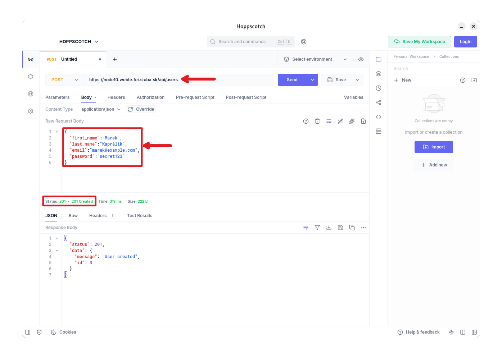
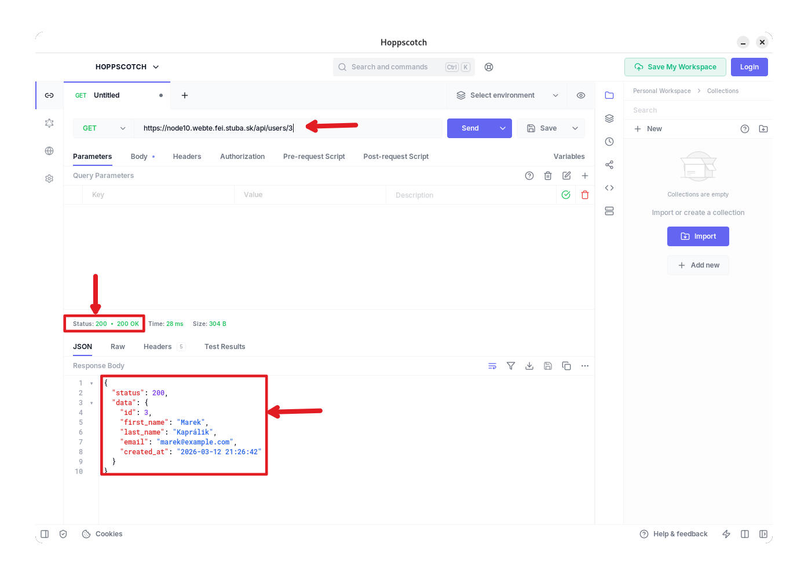

# Jednoduché API

V tomto návode si vytvoríme jednoduché REST API v jazyku PHP bez použitia frameworku. Cieľom je pochopiť základné princípy REST architektúry a spôsob, akým webový server odovzdáva požiadavky aplikácii. Implementácia bude zámerne jednoduchá, aby bolo jasné, ako funguje _routovanie_, spracovanie HTTP metód a vracanie JSON odpovedí. Server Nginx presmeruje všetky požiadavky na jeden vstupný skript. Tento skript následne odovzdá požiadavku vlastnému routeru.

Takýto prístup býva označovaný ako _Front controller pattern_, pretože všetky HTTP požiadavky najskôr prejdú cez jeden vstupný bod aplikácie. V praxi tento princíp používajú aj populárne frameworky, napríklad Laravel, len vo výrazne komplexnejšej podobe. V našom prípade si podobnú logiku implementujeme explicitne, aby bolo jasné, čo sa deje „pod kapotou“.

## Príprava

Najskôr si vytvoríme adresár, napríklad `api`. V tomto adresári bude niekoľko základných súborov. Hlavným vstupným bodom našej API bude súbor index.php. Okrem neho budeme mať samostatný súbor pre _router_, pomocnú triedu pre vytváranie JSON odpovedí (_response_) a priečinok s tzv. _controllers_. _Controllers_ budú obsahovať logiku jednotlivých API endpointov.

Výsledná štruktúra v rámci projektu môže vyzerať napríklad takto:

```
api/
 ├── index.php
 ├── Router.php
 ├── Response.php
 ├── controllers/
 │      └── UserController.php
 └── models/
        └── User.php
```

Tento alebo podobný spôsob organizácie je pomerne bežný aj vo väčších projektoch. Každá časť aplikácie má jasnú zodpovednosť: router rozhoduje, ktorý kód sa má spustiť, controller obsahuje logiku endpointu a pomocné triedy riešia napríklad formátovanie odpovedí.

## Konfigurácia Nginx serveru

Aby API fungovalo s čistými URL adresami, musí Nginx presmerovať všetky požiadavky do adresára `api` na súbor index.php. To zabezpečí direktíva `try_files`. Server najskôr skúsi nájsť existujúci súbor alebo adresár. Ak nič nenájde, požiadavku odošle na hlavný skript aplikácie.

Našu pôvodnú konfiguráciu _Virtual host_  modifikujeme tak, že pridáme navyše blok pre _location_, napríklad takto:

```conf
location /api/ {
    try_files $uri $uri/ /api/index.php?$query_string;
}
```

Po tejto konfigurácii môžeme používať URL adresy ako /users alebo /users/5 bez toho, aby sme museli v adrese uvádzať názov PHP súboru. V tomto prípade sa prepokladá, že adresár `api` sa nachádza priamo v koreňovom adresári servera. V prípade, že ho budete mať na inej úrovni, je potrebné upraviť direktívu aby obsahovala správnu cestu: `/CESTA-K-ADRESARU/api/index.php?$query_string`

## Vstupný bod API

Súbor `api/index.php` bude prvý kód, ktorý sa spustí pri každej požiadavke na našu API. Jeho úlohou je pripraviť prostredie, načítať potrebné súbory a definovať dostupné API _routes_. Tento súbor zároveň nastaví hlavičku odpovede, aby klient vedel, že server vracia dáta vo formáte JSON.

Príklad implementácie môže byť nasledujúci:

```php
<?php

require "Router.php";
require "controllers/UserController.php";

header("Content-Type: application/json");

$router = new Router();

$router->get("/users", [UserController::class, "index"]);
$router->get("/users/{id}", [UserController::class, "show"]);
$router->post("/users", [UserController::class, "create"]);
$router->put("/users/{id}", [UserController::class, "update"]);
$router->delete("/users/{id}", [UserController::class, "delete"]);

$router->run();
```

V tomto súbore vidíme definície jednotlivých endpointov našej API. Každá _route_ obsahuje HTTP metódu (`GET`, `POST`, `PUT` alebo `DELETE`), URL cestu a metódu daného _controlleru_, ktorá sa má vykonať. _Controller_ je PHP trieda, ktorá má definované metódy `index`, `show`, `create`, `update`, `delete`.

> Názvoslovie a štruktúra zápisov metód _routeru_ sa v tomto prípade podobá na zápis, ktorý používa aj framework Laravel.

Router je zodpovedný za porovnanie aktuálnej URL adresy s definovanými _routes_ - prvý argument metódy routra, napr. `"/users"`. Keď nájde zhodu, zavolá príslušnú metódu _controlleru_. Zároveň dokáže spracovať dynamické parametre v URL, napríklad {id}, ktorým vieme definovať identifikátor záznamu v databáze.

Zjednodušená implementácia routera môže vyzerať takto:

```php
<?php

class Router {

    private $routes = [];

    public function add($method, $route, $handler)
    {
        $this->routes[] = [
            "method"=>$method,
            "route"=>$route,
            "handler"=>$handler
        ];
    }

    public function get($route,$handler){ $this->add("GET",$route,$handler); }
    public function post($route,$handler){ $this->add("POST",$route,$handler); }
    public function put($route,$handler){ $this->add("PUT",$route,$handler); }
    public function delete($route,$handler){ $this->add("DELETE",$route,$handler); }

    public function run()
    {
        $method = $_SERVER["REQUEST_METHOD"];
        $uri = parse_url($_SERVER["REQUEST_URI"], PHP_URL_PATH);
        $uri = preg_replace("#^/api#", "", $uri);

        foreach ($this->routes as $route) {

            if ($route["method"] !== $method) {
                continue;
            }

            $pattern = preg_replace("#\{[a-zA-Z]+\}#", "([^/]+)", $route["route"]);
            $pattern = "#^".$pattern."$#";

            if (preg_match($pattern, $uri, $matches)) {

                array_shift($matches);

                [$class,$function] = $route["handler"];
                $controller = new $class;

                return call_user_func_array([$controller,$function],$matches);
            }
        }

        Response::json(["error"=>"Not Found"],404);
    }
}
```

Router analyzuje HTTP metódu a URL cestu. Ak nájde zodpovedajúcu definíciu _route_, zavolá metódu controlleru a odovzdá jej parametre z URL. V našom prípade, aby sme nemuseli zakaždým písať pred každú URL v `index.php` fragment `/api`, router ho odfiltruje pomocou `$uri = preg_replace("#^/api#", "", $uri);`.

## Logika endpointov

Controller obsahuje konkrétnu implementáciu logiky API. V našom príklade ide o jednoduchý `UsersController`, ktorý simuluje prácu s používateľmi - registráciu, získanie používateľa, úprava používateľa alebo vymazanie:

```php
<?php

require_once __DIR__.'/../../../config.php';
require_once __DIR__.'/../models/User.php';
require_once __DIR__.'/../Response.php';

class UserController {

    private User $userModel;

    public function __construct()
    {
        global $hostname, $database, $username, $password;
        $pdo = connectDatabase($hostname, $database, $username, $password);
        $this->userModel = new User($pdo);
    }

    public function index()
    {
        $users = $this->userModel->getAll();
        Response::json($users);
    }

    public function show($id)
    {
        $user = $this->userModel->getById((int)$id);

        if (!$user) {
            Response::json(["error" => "User not found"], 404);
        }

        Response::json($user);
    }

    public function create()
    {
        $data = json_decode(file_get_contents("php://input"), true);

        if (
            !isset($data["first_name"]) ||
            !isset($data["last_name"]) ||
            !isset($data["email"]) ||
            !isset($data["password"])
        ) {
            Response::json(["error" => "Missing required fields"], 400);
        }

        try {
            $id = $this->userModel->create(
                $data["first_name"],
                $data["last_name"],
                $data["email"],
                $data["password"]
            );

            Response::json([
                "message" => "User created",
                "id" => $id
            ], 201);

        } catch (PDOException $e) {

            if ($e->getCode() == "23000") {
                Response::json(["error" => "Email already exists"], 409);
            }

            Response::json(["error" => "Database error"], 500);
        }
    }

    public function update($id)
    {
        // ...
    }

    public function delete($id)
    {
        // ...
    }
```

Každá metóda _controlleru_ vracia odpoveď pomocou objektu `Response` vo formáte JSON a používa vhodný HTTP status kód. O tom, aký kód má metóda, resp. endpoint vrátiť aj s jeho významom je možné dočítať sa [napríklad tu](https://www.webfx.com/web-development/glossary/http-status-codes/).

`UserController` využíva triedu `User`, ktorá má definované metódy pre prácu s používateľmi nad databázou. Trieda obsahuje metódy, ktoré sme vytvárali pri registrácii a prihlasovaní používateľov. Je vhodné si teda tieto funkcie prepísať ako metódy triedy. V zjednodušenej podobe vyzerá trieda `User` napr. takto:

```php
<?php

class User
{
    private PDO $pdo;

    public function __construct(PDO $pdo)
    {
        $this->pdo = $pdo;
    }

    public function create(string $firstName, string $lastName, string $email, string $password): int
    {
        $hash = password_hash($password, PASSWORD_DEFAULT);

        $sql = "INSERT INTO user_accounts 
                (first_name, last_name, email, password_hash)
                VALUES (:first_name, :last_name, :email, :password_hash)";

        $stmt = $this->pdo->prepare($sql);

        $stmt->execute([
            ":first_name" => $firstName,
            ":last_name" => $lastName,
            ":email" => $email,
            ":password_hash" => $hash
        ]);

        return (int)$this->pdo->lastInsertId();
    }

    public function getById(int $id): ?array
    {
        $sql = "SELECT id, first_name, last_name, email, created_at
                FROM user_accounts
                WHERE id = :id";

        $stmt = $this->pdo->prepare($sql);
        $stmt->execute([":id"=>$id]);

        $user = $stmt->fetch(PDO::FETCH_ASSOC);

        return $user ?: null;
    }

    public function getByEmail(string $email): ?array
    {
        // ...
    }

    public function getAll(): array
    {
        // ...
    }

    public function update(int $id, string $firstName, string $lastName): bool
    {
        // ...
    }

    public function changePassword(int $id, string $password): bool
    {
        // ...
    }

    public function delete(int $id): bool
    {
        // ...
    }

    public function verifyPassword(string $email, string $password): bool
    {
        // ...
    }
```

Trieda poskytuje základné operácie nad tabuľkou `user_accounts`. Metóda `create()` vloží nového používateľa a uloží hash hesla. Metódy `getById()` a `getAll()` slúžia na čítanie dát. Metóda `update()` umožňuje zmeniť údaje používateľa, `changePassword()` mení hash hesla a `delete()` odstráni používateľa z databázy. Funkcia `verifyPassword()` slúži na overenie prihlasovacích údajov. Môžeme ju použiť napríklad pre login alebo aj pri resetovaní hesla.

Takáto trieda sa často nazýva `model` alebo `repository` a predstavuje vrstvu medzi databázou a API kontrolérmi. V pokročilých frameworkoch je možné v modeli definovať priamo názvy stĺpcov tabuliek alebo aj tabuľky samotné, rôzne vzťahy medzi entitami a pod. K mapovaniu sa následne využívajú tzv. _ORM - Object Relation Mapping_ techniky, ktoré konvertujú dáta medzi relačnou databázou a triedou objektovo-orientovaného jazyka.

## Testovanie API

Po nasadení adresára a prekonfigurovaní servera môžeme API testovať pomocou nástrojov ako Postman, HTTPie, Hoppscotch, `curl` alebo jednoduchým HTTP klientom v prehliadači. 

Napríklad požiadavka POST na URL `/users` nám umožňuje vytvoriť nového používateľa. Do tela požiadavky zadáme požadované JSON dáta a po odoslaní nám server vráti odpoveď, status kód, prípadne údaje, ktoré sme si vyžiadali:



Požiadavka GET /users/3 zasa vráti konkrétneho používateľa s identifikátorom 3.


